# 🏥 نظام إطمن لإدارة الطوارئ والأزمات الصحية (Etmen Health Emergency Management System)

<div align="center">

  [](https://etmen.runasp.net/)
  [](https://github.com/ItcProjects-R4/SHR4_SWD5_S1_PROJECT3)
  [](https://github.com/ItcProjects-R4/SHR4_SWD5_S1_PROJECT3)
  [](https://github.com/ItcProjects-R4/SHR4_SWD5_S1_PROJECT3)
  [](https://qabilah.com/hackathon/255665101472799432/projects/256289137156423680)

</div>

> [!IMPORTANT]
> 🏆 **صفحة المشروع على هكاثون قبيلة:** [https://qabilah.com/hackathon/255665101472799432/projects/256289137156423680](https://qabilah.com/hackathon/255665101472799432/projects/256289137156423680)  
> 🌐 **رابط تشغيل المشروع الفعلي (Live App):** [https://etmen.runasp.net/](https://etmen.runasp.net/)  
---

## 🔐 بيانات الدخول الأولية للتجربة (Demo Credentials)
لتسهيل عملية مراجعة وتقييم النظام من قبل لجنة التحكيم بالوزارة دون الحاجة لإنشاء حسابات جديدة، تم حقن قاعدة البيانات مسبقاً (Seeding) بالحسابات التجريبية التالية لتمثيل كافة الأدوار المتكاملة في المنظومة:

| الدور (Role) | البريد الإلكتروني (Email) | كلمة المرور (Password) | الوصف والصلاحيات (Description & Access) |
| :--- | :--- | :--- | :--- |
| 👨‍💼 **مدير النظام (Admin)** | `admin@etmen.com` | `Admin@123` | لوحة تحكم الأزمات الوبائية، الخريطة الحرارية، تفعيل حسابات الأطباء والمستشفيات، وتصدير التقارير والـ KPIs. |
| 🏨 **موظف المستشفى (Hospital Staff)** | `staff@etmen.com` | `Staff@123` | استقبال وإدارة طابور الطوارئ (Emergency Queue) والـ Triage، وتحديث سعة الأسرة العادية وأسرة العناية المركزة (ICU). |
| 👨‍⚕️ **أطباء تجريبيين (Doctors)** | `doctor1@etmen.com`<br>*(وكذلك الحسابات من `doctor_bulk_1@etmen.com` إلى `doctor_bulk_70@etmen.com` بكلمة مرور `Etmen@123`)* | `Doctor@123` | إدارة بيانات عيادات الطبيب، جدولة فترات العمل (Slots)، تتبع سجلات المرضى، واستقبال نداءات الاستغاثة (Panic Inbox). |
| 🤕 **مرضى تجريبيين (Patients)** | `patient1@etmen.com`<br>*(وكذلك الحسابات من `patient_bulk_1@etmen.com` إلى `patient_bulk_100@etmen.com` بكلمة مرور `Etmen@123`)* | `Patient@123` | تصفح لوحة المريض، إدخال المؤشرات الحيوية، رفع التحاليل الطبية وقراءتها (OCR)، تفعيل الاستغاثة الفورية، والربط العائلي. |

---

## 📌 الفهرس
1. [🌟 اسم المشروع وشعاره](#-اسم-المشروع-وشعاره)
2. [💡 فكرة المشروع](#-فكرة-المشروع)
3. [🎯 أهداف المشروع](#-أهداف-المشروع)
4. [🏗️ البنية المعمارية للنظام الهيكل التنظيمي الموحد (Clean Architecture)](#%EF%B8%8F-البنية-المعمارية-للنظام-الهيكل-التنظيمي-الموحد-clean-architecture)
5. [🗺️ المنظومة الجغرافية والخرائط التفاعلية (Geographical Intelligence)](#%EF%B8%8F-المنظومة-الجغرافية-والخرائط-التفاعلية-geographical-intelligence)
6. [🔄 الخط التزامني وسيناريو تدفق العمل المتزامن (Synchronous Workflows)](#-الخط-التزامني-وسيناريو-تدفق-العمل-المتزامن-synchronous-workflows)
7. [🛠️ التقنيات المستخدمة](#%EF%B8%8F-التقنيات-المستخدمة)
8. [💎 أهم مميزات المشروع](#-أهم-مميزات-المشروع)
9. [🔌 تكاملات الخدمات الخارجية (APIs & Services)](#-تكاملات-الخدمات-الخارجية-apis--services)
10. [🚀 خطوات تشغيل المشروع](#-خطوات-تشغيل-المشروع)
11. [📸 لقطات وصور من المشروع](#-لقطات-وصور-من-المشروع)
12. [⚠️ التحديات التي واجهتنا أثناء التنفيذ](#%EF%B8%8F-التحديات-التي-واجهتنا-أثناء-التنفيذ)
13. [🔮 الأفكار والتطويرات المستقبلية](#-الأفكار-والتطويرات-المستقبلية)
14. [👥 أعضاء الفريق وتوزيع المهام](#-أعضاء-الفريق-وتوزيع-المهام)
15. [🎥 رابط فيديو الشرح التفصيلي](#-رابط-فيديو-الشرح-التفصيلي)

---

## 🌟 اسم المشروع وشعاره (Project Brand & Identity)
* **اسم المشروع:** **إطمن (Etmen)** - النظام الرقمي المتكامل لإدارة الطوارئ والقدرات الاستيعابية للمنشآت الطبية.
* **شعار المشروع:** *"التكنولوجيا في خدمة الحياة.. رعاية صحية أسرع، حياة أكثر أماناً"*
* **الفلسفة والرمزية:**  
  تم اختيار الاسم **"إطمن"** ليكون رسالة طمأنينة مباشرة للمريض وأسرته في لحظات الخوف والذعر المصاحبة للطوارئ الصحية. فلسفة النظام تقوم على تحويل عملية إنقاذ المريض من "رحلة عشوائية يسودها الذعر والبحث عن سرير شاغر" إلى "رحلة مؤتمتة ومدروسة بالكامل بنقرة زر واحدة"، مما يعكس الطمأنينة والأمان النفسي لجميع أطراف المنظومة الطبية.
  
> [!TIP]
> 💡 ****
> * **الهندسة النفسية للتصميم (Psychological UX Engineering):** تصميم الهوية البصرية وتجربة المستخدم يرتكز على تقليل التوتر المصاحب للحالات الطارئة. استخدام تدرجات اللون الأزرق الطبي (الذي يعزز الاستقرار النفسي والثقة) والأخضر الفيروزي (الذي يعزز الأمل والتعافي) لتقديم واجهات هادئة وسلسة في الاستخدام تحت الضغط.
> * **فلسفة الربط الخماسي التزامني:** دمج 5 أدوار متكاملة (المريض، الطبيب، موظف الطوارئ بالمستشفى، المسعف، ومدير النظام الحكومي) في شاشة تفاعلية واحدة لضمان أعلى مستويات الأمان والموثوقية.

---

## 💡 فكرة المشروع (Core Project Concept)
منصة **إطمن** هي منظومة برمجية متكاملة للرعاية الصحية الطارئة وإدارة الأزمات الوبائية، تعمل بالويب وتدمج الذكاء الاصطناعي (AI) ونظم المعلومات الجغرافية (GIS) لتقديم استجابة فورية للأزمات الصحية.
تقوم الفكرة على **إلغاء المركزية التقليدية في إدارة الطوارئ** عبر بناء نظام بيئي متزامن وذكي يتميز بـ:
1. **نظام الاستغاثة الذكي التلقائي (Automated Panic Dispatch):** نقرة زر واحدة من هاتف المريض تكفي لتحديد موقعه الجغرافي بالـ GPS ومطابقته فوراً مع أقرب مستشفى يمتلك سرير عناية مركزة شاغراً ووحدة إسعاف متاحة.
2. **محرك الفرز الطبي الرقمي (Dynamic Triage Engine):** تقييم ذاتي للمخاطر وتصنيف فئات الطوارئ بدقة وسرعة البرق لتجنب إغراق أقسام الطوارئ بحالات غير حرجة.
3. **محرك الاستخلاص الذكي للتقارير (AI-OCR Medical Analyzer):** استخدام الذكاء الاصطناعي لقراءة تحاليل المريض المكتوبة أو المطبوعة بالـ OCR، واستخلاص النسب وتحديد مؤشرات الخطورة تلقائياً وعرضها للطبيب.
4. **تتبع السعة الاستيعابية الحية (Live Bed & Capacity Tracking):** إدارة فورية وحية للأسرة الشاغرة وأسرة الرعاية المركزة (ICU) لمنع ظاهرة "الأسرة الوهمية" وضمان توجيه الطوارئ للمكان الصحيح.

> [!TIP]
> 💡 ** **
> * **المرونة والقدرة على التكيف الوبائي الفوري (Dynamic Epidemic Adaptation):** النظام ليس مبنياً لسيناريو وبائي واحد؛ بل يتيح لمدير النظام تهيئة وتدشين أي وباء جديد (مثل Hanta أو كورونا المتحور) وتحديد أعراضه وأوزان خطورته فوراً، ليتكيف محرك الأسئلة والتقييم الذاتي للمريض تلقائياً في نفس اللحظة دون الحاجة لتغيير كود برمجى واحد.
> * **تكامل معالجة المستندات بالـ OCR المتطور:** قراءة التحاليل الطبية والروشتات واستخلاص العلامات الشاذة (مثل نسب الهيموجلوبين أو الكرياتينين غير الطبيعية) وربطها بالملف الطبي للمريض في ثوانٍ معدودة لتسهيل اتخاذ القرار الطبي.

---

## 🎯 أهداف المشروع (Project Strategic Objectives)
تمت صياغة أهداف مشروع **إطمن** لتتوافق مع **رؤية مصر 2030 للتحول الرقمي وتطوير منظومة الرعاية الصحية**:

### 1. الأهداف الإستراتيجية القومية (National Strategic Goals)
* 🇪🇬 **دعم التحول الرقمي بقطاع الصحة المصري:** إثبات إمكانية بناء منظومة تتبع موارد صحية مركزية تخدم متخذي القرار بوزارة الصحة لرصد بؤر انتشار الأوبئة جغرافياً وتوجيه الدعم اللوجستي للمستشفيات بدقة.
* 📈 **تصفير الهدر التشغيلي للموارد:** القضاء على نقص الأسرة وسيارات الإسعاف عبر التوزيع الجغرافي والتشغيلي المتزن المبني على السعة الفعلية المحدثة بالثانية.

### 2. الأهداف التقنية والابتكارية (Innovative Technical Goals)
* 🤖 **توطين تطبيقات الذكاء الاصطناعي (AI):** دمج قراءة المستندات بالـ OCR والمساعد الطبي الذكي (Chatbot) لتسريع الفرز الأولي للحالات وتوفير وقت الأطباء في كتابة التقارير.
* 🗺️ **الاستخبارات الجغرافية (Geospatial Intelligence):** دمج الخرائط التفاعلية والـ Real-time GIS لتتبع سيارات الإسعاف وحساب دقيق لوقت الوصول المتوقع (ETA) استناداً إلى حركة المرور والمسارات البديلة.

### 3. الأهداف المجتمعية والإنسانية (Humanitarian & Community Goals)
* 🕐 **تأمين "الدقيقة الذهبية" لإنقاذ الحياة:** تقليل زمن استجابة سيارات الإسعاف ووصول المريض للسرير الشاغر بنسبة تتجاوز 40%، وهو الفارق الحاسم بين الحياة والموت في حالات السكتات الدماغية أو الأزمات القلبية.
* 👨‍👩‍👧‍👦 **رعاية صحية عائلية متكاملة (Family Care Circle):** تمكين الأفراد من ربط حساباتهم الطبية بأفراد عائلتهم (كبار السن أو الأطفال)، لتلقي إشعارات الطوارئ وتتبع حالتهم الحيوية وتاريخهم المرضي عن بُعد وبشكل فوري.

> [!TIP]
> 💡 ****
> * **توجيه الطوارئ الديناميكي المبني على الذكاء الاصطناعي والجغرافيا:** النظام يمنع سيناريوهات إرسال سيارة إسعاف لمستشفى يمر بحالة تكدس أو لا يحتوي على أسرة رعاية شاغرة، حيث يقوم محرك التوجيه بإعادة التوجيه التلقائي للمريض بناءً على السعة الفعلية الفورية وقرب المسافة.
> * **منظومة العناية الأسرية التزامنية:** حل مشكلة اجتماعية حرجة عبر تمكين المغتربين والشباب من متابعة المؤشرات الحيوية لآبائهم وأمهاتهم المصابين بأمراض مزمنة وتلقي نداءات استغاثتهم فوراً.

---

## 🏗️ البنية المعمارية للنظام الهيكل التنظيمي الموحد (Clean Architecture)
تم تصميم وتطوير نظام **إطمن** بالاعتماد الكامل على نمط **الهندسة البرمجية النظيفة (Clean Architecture)**. يهدف هذا التصميم إلى فصل الاهتمامات (Separation of Concerns)، وجعل النظام مستقلاً عن قواعد البيانات وأطر العمل الخارجية، مما يسهل عملية الاختبار (Testing) وصيانة وتحديث الأكواد مستقبلاً.

فيما يلي **الهيكل التنظيمي الشامل للملفات والمشاريع الفرعية** المكونة للحل البرمجي (Solution Structure) بالتفصيل:

```
Etmen_DEPI_Project/
├── Etmen_Domain/                              # طبقة النطاق الأساسي (Core Domain Layer)
│   ├── Entities/                              # الكيانات الأساسية لقاعدة البيانات
│   │   ├── ApplicationUser.cs                 # بيانات حسابات المستخدمين وإعدادات الأمان
│   │   ├── PatientProfile.cs                  # الملف الطبي للمريض وقراءاته الحيوية والأمراض المزمنة
│   │   ├── DoctorProfile.cs                   # الملف المهني للطبيب وبيانات التراخيص المهنية
│   │   ├── HealthcareProvider.cs              # بيانات المستشفيات والمراكز الطبية المعتمدة ومواقعها
│   │   ├── EmergencyRequest.cs                # بلاغات الاستغاثة وتفاصيل طلبات الطوارئ وتتبع المواقع
│   │   ├── CrisisConfiguration.cs             # إعدادات الأزمات والأوبئة النشطة والأعراض المخصصة
│   │   ├── LabResult.cs                       # نتائج التحاليل الطبية المرفوعة والملفات المرفقة
│   │   ├── MedicalRecord.cs                   # السجلات الطبية والتشخيصات والوصفات المكتوبة بواسطة الأطباء
│   │   ├── Alert.cs                           # التنبيهات الطبية والوبائية الواردة للمستخدمين
│   │   ├── ChatMessage.cs                     # الرسائل الفورية والمرفقات بين الطبيب والمريض
│   │   ├── SymptomWeight.cs                   # أوزان الأعراض المحددة لحساب الخطورة الوبائية
│   │   ├── OutbreakZone.cs                    # بؤر ومناطق تفشي الأوبئة جغرافياً وإحصائياتها
│   │   ├── StaffProfile.cs                    # الملف الشخصي لموظفي الاستقبال وممثلي الطوارئ بالمستشفى
│   │   └── StaffActivityLog.cs                # سجل أنشطة طاقم العمل للرقابة والمراجعة الأمنية
│   └── Enums/                                 # الثوابت الطبية والتشغيلية للنظام
│       ├── UserRole.cs                        # أدوار المستخدمين (Patient, Doctor, HospitalStaff, Admin, Guest)
│       ├── RiskLevel.cs                       # مستويات الخطورة الطبية (High, Medium, Low, Critical)
│       ├── EmergencyRequestStatus.cs          # حالات طلب الطوارئ (Pending, Dispatched, Arrived, Completed, Cancelled)
│       ├── AppointmentStatus.cs               # حالة الحجز (Pending, Confirmed, Cancelled, Completed)
│       ├── CrisisType.cs                      # نوع الأزمة (Epidemic, Pandemic, NaturalDisaster)
│       └── StaffRoleType.cs                   # أدوار طاقم المستشفى (TriageStaff, AdminStaff)
│
├── Etmen_DAL/                                 # طبقة الوصول للبيانات (Data Access Layer)
│   ├── DbContext/                             # اتصال الكيانات بقاعدة البيانات
│   │   └── EtmenDbContext.cs                  # سياق قاعدة البيانات وتكوين العلاقات والجداول عبر Fluent API
│   ├── Repositories/                          # مستودعات معالجة البيانات وعزل استعلامات SQL
│   │   ├── Interfaces/                        # واجهات مستودعات البيانات لعزل الأكواد
│   │   │   ├── IGenericRepository.cs          # الواجهة العامة لعمليات الـ CRUD الأساسية لكافة الكيانات
│   │   │   ├── IPatientProfileRepository.cs   # واجهة مستودع ملفات وعلامات المرضى الحيوية
│   │   │   └── IUnitOfWork.cs                 # واجهة وحدة العمل لجمع كافة المستودعات وحفظها
│   │   └── Implementations/                   # التطبيق الفعلي لمستودعات البيانات وعزل SQL
│   │       ├── GenericRepository.cs           # التطبيق العام لعمليات الـ CRUD باستخدام Entity Framework
│   │       ├── PatientProfileRepository.cs    # تطبيق عمليات قاعدة بيانات ملفات وتاريخ المرضى
│   │       └── UnitOfWork.cs                  # جمع وحفظ كافة التعديلات كعملية واحدة (SaveAsync)
│   └── Seeding/                               # تهيئة البيانات الأولية الافتراضية
│       └── DataSeeder.cs                      # توليد الحسابات والأدوار وأوزان الأعراض والأزمات الافتراضية
│
├── Etmen_BLL/                                 # طبقة منطق الأعمال والخدمات (Business Logic Layer)
│   ├── Repositories/                          # واجهات وخدمات المنطق الطبي للأعمال
│   │   ├── IServices/                         # عقود الخدمات والواجهات الطبية
│   │   │   ├── IAuthService.cs                # واجهة عمليات التحقق والأمان والـ Identity
│   │   │   ├── IPatientService.cs             # واجهة متابعة المؤشرات والملفات الطبية وتفاصيل لوحة المريض
│   │   │   ├── IDoctorService.cs              # واجهة الجدولة والعمليات الطبية والعيادات الخاصة بالأطباء
│   │   │   ├── IEmergencyService.cs           # واجهة بلاغات طلب الإسعاف والفرز والتصعيد الطبي
│   │   │   └── ICrisisRiskEngineService.cs    # واجهة محرك احتساب مخاطر الأزمات والأوبئة وبؤر التفشي
│   │   └── Services/                          # التطبيق الفعلي للمنطق والخدمات الطبية
│   │       ├── AuthService.cs                 # تطبيق عمليات التسجيل والتحقق بالبريد والـ Identity
│   │       ├── PatientService.cs              # إدارة بيانات المرضى والمؤشرات الحيوية والتاريخ المرضي
│   │       ├── DoctorService.cs               # تنظيم مواعيد الأطباء وعياداتهم وجدول فترات العمل المتاحة
│   │       ├── EmergencyService.cs            # إدارة نداءات الاستغاثة والإسعاف والتوجيه الجغرافي للمستشفى المتاح
│   │       ├── CrisisRiskEngineService.cs     # محرك حساب معاملات التفشي الوبائي ورسم الخريطة الحرارية
│   │       ├── AIChatService.cs               # تطبيق محرك استشارات المساعد الذكي (Gemini API)
│   │       ├── LabService.cs                  # رفع وقراءة تحاليل الدم وتصفية القيم الشاذة OCR
│   │       └── PdfReportService.cs            # تصدير تقارير الأوبئة والأدوار والتقارير الطبية بصيغة PDF
│   ├── DTOs/                                  # كائنات نقل البيانات وعزل الكيانات عن الواجهات (Data Transfer Objects)
│   └── Mapping/                               # تنظيم تحويل الكيانات لـ DTOs
│       └── BLLMappingProfile.cs               # ملف إعداد التحويل التلقائي السريع للذاكرة باستخدام (Mapster)
│
└── Etmen_PL/                                  # طبقة العرض والواجهات (Presentation Layer)
    ├── Controllers/                           # كنترولرات معالجة طلبات المستخدمين (29 كنترولر)
    │   ├── AccountController.cs               # إدارة الحسابات، الدخول، وتأكيد البريد الإلكتروني
    │   ├── PatientDashboardController.cs      # لوحة تحكم المريض وعرض حالته الصحية الحيوية
    │   ├── PatientProfileController.cs        # إدارة بيانات المريض الشخصية وقياساته
    │   ├── PatientAppointmentsController.cs   # حجز المواعيد وتتبعها وإلغائها للمريض
    │   ├── LabResultsController.cs              # رفع تحاليل الدم وتكامل القراءة البصرية OCR للنتائج
    │   ├── RiskAssessmentController.cs        # محرك تقييم المخاطر الذاتي بناءً على الأعراض والخطورة
    │   ├── NearbyProvidersController.cs       # البحث الجغرافي عن المستشفيات والعيادات على الخريطة
    │   ├── FamilyLinkingController.cs         # ربط حسابات العائلات ومشاركة السجلات الحيوية
    │   ├── AlertsController.cs                # عرض التنبيهات الصحية والوبائية الواردة للمستخدم
    │   ├── ReviewsController.cs                 # تقييمات المرضى للخدمات الطبية والأطباء
    │   ├── DoctorDashboardController.cs       # لوحة تحكم الطبيب وجدول المواعيد اليومي وإحصائياته
    │   ├── DoctorProfileController.cs         # إعداد التخصص والبيانات المهنية للطبيب وتراخيصه
    │   ├── DoctorClinicController.cs          # إدارة بيانات عيادة الطبيب وتفاصيل العمل والموقع الجغرافي
    │   ├── DoctorSlotsController.cs           # تنظيم وإضافة فترات الحجز المتاحة للمرضى
    │   ├── DoctorAppointmentsController.cs    # تتبع وإدارة حالة المواعيد الطبية المحجوزة
    │   ├── DoctorPatientsController.cs        # البحث في سجل السيرة الطبية والتاريخي للمرضى
    │   ├── DoctorPanicInboxController.cs      # صندوق حالات الذعر والاستغاثة الفورية الواردة للمرضى
    │   ├── MedicalRecordsController.cs        # إدخال التشخيصات والتقارير الطبية للمرضى والوصفات
    │   ├── EmergencyController.cs             # طلب سيارة الإسعاف وتتبع حالة الطوارئ جغرافياً
    │   ├── HospitalQueueController.cs         # إدارة طابور الطوارئ الطبي وتوزيع الحالات في طاقم العمل
    │   ├── HospitalStaffManagementController.cs # إدارة الموظفين الطبيين داخل المستشفيات والورديات
    │   ├── ChatController.cs                  # المحادثات الفورية مريض-طبيب (Real-Time Chat)
    │   ├── ChatbotController.cs                 # المحادثة الطبية الاستشارية مع مساعد الذكاء الاصطناعي
    │   ├── AdminDashboardController.cs        # لوحة تحكم مشرف النظام العام وعرض مؤشرات القياس والـ KPIs
    │   ├── AdminUsersController.cs            # إدارة حسابات المستخدمين (تفعيل، تعطيل، تعديل أدوار)
    │   ├── AdminProvidersController.cs        # إدارة المستشفيات والمراكز الطبية المعتمدة
    │   ├── AdminCrisisController.cs           # مركز إدارة الأوبئة وإعدادات الخريطة الحرارية
    │   ├── AdminReportsController.cs            # تصدير تقارير النظام والتقييمات العامة
    │   └── HomeController.cs                  # الصفحة التعريفية الرئيسية للمنصة
    ├── Hubs/                                  # قنوات الاتصال بالوقت الفعلي (SignalR Hubs)
    │   ├── ChatHub.cs                         # بث رسائل الاستشارات الطبية الفورية مريض-طبيب
    │   ├── QueueHub.cs                        # تحديث طوابير فرز الطوارئ بالمستشفيات حياً
    │   └── EmergencyHub.cs                    # تتبع وبث إحداثيات سيارة الإسعاف الجغرافية حياً
    ├── Filters/                               # فلاتر التحقق الأمني المسبق وإلزام البيانات
    │   ├── DoctorOnboardingFilter.cs          # إلزام الطبيب بتسجيل ترخيصه وتخصصه قبل الدخول
    │   ├── PatientProfileFilter.cs            # إلزام المريض بإدخال فصيلة دمه ومؤشراته الطبية
    │   └── MaintenanceFilter.cs               # تعطيل خدمات النظام مؤقتاً أثناء الصيانة
    └── Views/                                 # واجهات وتصميم المنصة (Razor Views)
```

---

## 🗺️ المنظومة الجغرافية والخرائط التفاعلية (Geographical Intelligence)
تُعد **المنظومة الجغرافية والخرائط التفاعلية حية المصدر** الركيزة الأساسية وعنصر الإبهار الأكبر في نظام **إطمن**، حيث تم تطوير أربع خرائط ذكية وتفاعلية كاملة تؤدي أدواراً تشغيلية ووبائية بالوقت الفعلي:

```
┌─────────────────────────────────────────────────────────────────────────┐
│                          نظام إطمن الجغرافي                            │
├───────────────┬────────────────────────┬───────────────┬────────────────┤
│ خريطة تتبع   │ الخريطة الحرارية        │ خريطة أقرب    │ الخريطة الكلية │
│ الإسعاف الحية │ للأزمات والأوبئة       │ مقدم خدمة     │ للشبكة الطبية  │
└───────────────┴────────────────────────┴───────────────┴────────────────┘
```

### 1. خريطة تتبع سيارات الإسعاف اللحظية (Ambulance Live Dispatch Map)
* **المفهوم البرمجي:** نظام تتبع ديناميكي عبر خريطة الطوارئ يربط المستشفى والمريض بسيارة الإسعاف.
* **كيف تعمل؟** بمجرد قبول المستشفى لطلب طوارئ نشط من خلال الكنترولر `HospitalQueueController` وبدء تحرك سيارة الإسعاف، تُظهِر الخريطة موقع المستشفى جغرافياً وموقع المريض المستغيث وتتبعاً حياً لموقع سيارة الإسعاف لتحديد مسار الحركة، مع تغذية لحظية للبيانات عبر `SignalR` ومسارات البيانات البرمجية في `GetActiveDispatchMap`.

### 2. الخريطة الحرارية للأزمات والأوبئة (Crisis Outbreak Heatmap Map)
* **المفهوم البرمجي:** لوحة المراقبة الجغرافية للأوبئة والفيروسات النشطة لمكافحتها مبكراً.
* **كيف تعمل؟** تعتمد الخريطة على استقبال إدخالات المرضى للأعراض وتقييمات المخاطر الذاتية المسجلة وتكاملها مع بؤر الانتشار في الكنترولر `AdminCrisisController` و `CrisisRiskEngineService`. تقوم الخريطة برسم نطاقات حرارية متدرجة الألوان (بؤر ساخنة حمراء Outbreak Zones) على الخريطة لتوضيح جغرافية تفشي الفيروسات لمساعدة الوزارة والجهات الإدارية على اتخاذ قرارات الحظر الطبي الفوري.

### 3. خريطة أقرب مقدم خدمة ومستشفى طوارئ (Nearby Providers Finder Map)
* **المفهوم البرمجي:** أداة بحث جغرافي للمرضى والزوار تعمل بالربط التلقائي مع مستشعرات الـ GPS.
* **كيف تعمل؟** تقوم الخريطة من خلال الكنترولر `NearbyProvidersController` بالتقاط إحداثيات موقع المريض والبحث تلقائياً في قاعدة البيانات ضمن دائرة قطرها 10 كيلومترات (أو 50 كم في الحالات الطارئة جداً)، وعرض أقرب المستشفيات والعيادات على الخريطة التفاعلية مع إظهار القدرة الاستيعابية وعدد الأسرة الشاغرة (ICU Bed Availability) لكل مستشفى مع زر حجز فوري للموعد.

### 4. خريطة التغطية والاتصال الطبي الشامل (Telemetry Normal Map)
* **المفهوم البرمجي:** لوحة التحكم الشاملة لمديري النظام لإعطاء نظرة بانورامية على الوضع الصحي العام بالبلد بالوقت الفعلي.
* **كيف تعمل؟** تقوم الخريطة عبر الكنترولر `AdminDashboardController` و دالة `GetMapData` بتجميع وعرض علامات (Markers) تفاعلية لكافة المستشفيات المفعلة، والعيادات الخاصة، والأطباء المتصلين بالمنظومة، وحالات الطوارئ النشطة وتوزيعها الجغرافي على مستوى خريطة البلد.

---

## 🔄 الخط التزامني وسيناريو تدفق العمل المتزامن (Synchronous Workflows)
يعمل نظام **إطمن** بآلية اتصال وتدفق متزامن كاملة تربط كافة الأطراف والعمليات في الوقت الفعلي. يمثل السيناريو التالي كيفية معالجة النظام للطلبات وتفاعل الأدوار فور حدوث أي تحديث صحي:

### 1. 🤕 رحلة المريض المتكاملة (Patient Journey Flow)
1. **التسجيل الأولي:** يسجل المستخدم حساباً جديداً كـ "مريض" في النظام وتأمين الحساب برمز تحقق بريدي.
2. **إكمال السجل الحيوي (Profile Setup):** يوجه فلتر الحساب `PatientProfileFilter` المريض فور دخوله إجبارياً لإدخال مؤشراته الصحية وعلاماته الحيوية الأساسية وفصيلة دمه.
3. **الربط العائلي (Family Link):** يدخل المريض أرقام حسابات عائلته لربطهم وتفويضهم بالاطلاع الطبي وتلقي بلاغات طوارئه.
4. **تقييم المخاطر وتنشيط الموقع (GPS Assessment):** يقيس المريض أعراضه الحالية عبر محرك المخاطر (`RiskAssessmentController`) مع تفعيل مشاركة موقعه الجغرافي الحالي.
5. **الاستجابة التزامنية الفورية للحالات الحرجة (الوضع خطير):** بمجرد تصنيف محرك المخاطر للحالة كـ "حرجة":
   * **إخطار الاستقبال بالمستشفى:** يتم إرسال طلب استغاثة حاد مزود ببيانات المريض وموقعه الجغرافي إلى طابور طوارئ أقرب مستشفى حياً (`HospitalQueueController` عبر `QueueHub`).
   * **توجيه سيارة الإسعاف:** يتم توجيه سيارة إسعاف فوراً إلى إحداثيات المريض وتتبعها على الخريطة التفاعلية.
   * **إرسال الحالة لأقرب طبيب طوارئ:** تُرسل بيانات ومؤشرات المريض الحيوية لصندوق الحالات الحرجة لأقرب طبيب متاح لتولي المتابعة الطبية (`DoctorPanicInboxController`).
   * **تنبيه العائلة:** يُرسل إشعار طوارئ لحظي بالبريد لأفراد عائلته المسجلين بالمنصة.
   * **لوحة الأزمات الإدارية:** تُرسل إحداثيات موقع المريض لتظهر تلقائياً كـ "بؤرة تفشي نشطة" في الخريطة الحرارية للأوبئة لمديري النظام.

### 2. 👨‍⚕️ رحلة الطبيب ومتابعة الحالات الطارئة (Doctor Flow)
1. **تسجيل التخصص والترخيص:** يسجل الطبيب الحساب ويتم فلترته عبر `DoctorOnboardingFilter` لتأكيد ترخيصه وموقع عيادته جغرافياً.
2. **جدولة وتجهيز الفترات:** يقوم الطبيب بفتح فترات الحجز (Slots) المتاحة للمرضى العاديين لتأكيدها أو إلغائها.
3. **الاستجابة لنداءات الذعر (Panic Responses):** بمجرد إرسال مريض مرتبط به لإشارة ذعر (Panic Alert)، يتلقى الطبيب إخطاراً صوتياً ومرئياً حياً بصندوق نداءات الاستغاثة، وبدء محادثة فورية مع المريض أو المسعف المرافق.
4. **التدوين والتشخيص الفوري:** يسجل الطبيب التدهور الطارئ والجرعة المطلوبة لتضاف فوراً في السجل التاريخي للمريض (`MedicalRecordsController`).

### 3. 🏨 رحلة موظف الطوارئ والمستشفى (Hospital Staff Flow)
1. **مراقبة طابور فرز الحالات (Triage Queue):** استقبال بلاغات إسعاف الطوارئ جغرافياً بالوقت الفعلي على شاشة طابور الفرز (`QueueHub`).
2. **مراجعة وتوجيه الحالات:** قراءة فصيلة الدم والحالة العامة وحظر التوجيه الخاطئ بقبول الحالة فوراً أو إعادة توجيهها لمستشفى مجاور.
3. **تحديث السعة الاستيعابية:** تحديث أعداد الأسرة المتاحة وغرف العناية المركزة (ICU Beds) دورياً، مما يعكس سعة المستشفى فورياً في خرائط البحث لدى المرضى.
4. **تتبع وإدارة سيارات الإسعاف المخصصة للمستشفى:** يراقب موظف المستشفى حصرياً سيارات الإسعاف التابعة للمستشفى والنشطة حالياً، ويتتبع حركتها (رايحه فين وجايه فين) على الخريطة الخاصة بقسم الاستقبال لتهيئة غرف العمليات والمسعفين لاستقبال الحالة فور وصول السيارة.

### 4. 👨‍💼 رحلة مدير النظام ومسؤول الأزمات (Admin & Crisis Flow)
1. **مراقبة التغطية الصحية والـ KPIs:** مراجعة إحصائيات سرعة الاستجابة، وتصدير التقارير الإدارية وتوثيق تراخيص الكيانات الجديدة.
2. **تفعيل وإدارة الأزمة الوبائية عند التفشي (Crisis Declaration):** عند رصد بوادر تفشي مرض وبائي (مثل كورونا، إنفلونزا، إلخ)، يقوم المشرف فوراً بـ:
   * **إضافة الوباء الجديد:** إدخال اسم الوباء الجديد في لوحة التحكم وتحديد مستوى خطورته الكلية (Critical, High, Medium).
   * **تهيئة الأوزان الطبية للأعراض (Symptom Weights):** ربط الأعراض المرافقة للوباء الجديد (مثل ضيق التنفس، السعال، درجة الحرارة) وتحديد أوزانها النسبية لتفعيلها في محرك المخاطر لتحديث نتائج تقييم المرضى تلقائياً.
   * **تفعيل وضع الأزمة عالمياً (Crisis Mode):** تحويل النظام بالكامل لوضع الأزمات وبدء حساب عوامل التفشي الجغرافي تلقائياً.
3. **مراقبة حركة كافة سيارات الإسعاف بالجمهورية:** يمتلك المسؤول شاشة تتبع مركزية تمكنه من مراقبة مسار وحركة كافة سيارات الإسعاف التابعة للشبكة بأكملها (رايحه فين وجايه فين جغرافياً)، لمعالجة حالات الاختناق المروري أو التأخير التشغيلي.
4. **إدارة بؤر الانتشار الجغرافية:** تحليل الخريطة الحرارية (Outbreak Heatmap) وتتبع تمركز الحالات الحرجة لتوجيه الدعم اللوجستي وتنسيق حظر الطوارئ الجغرافي.

---

## 🛠️ التقنيات المستخدمة
* **الإطار الأساسي للويب:** ASP.NET Core 10.0 MVC (Net 10.0).
* **لغة البرمجة:** C# (C-Sharp).
* **محرك قواعد البيانات:** Microsoft SQL Server.
* **الربط مع البيانات (ORM):** Entity Framework Core 10.
* **المراسل اللحظي بالوقت الفعلي:** ASP.NET Core SignalR.
* **تصدير التقارير:** مولد تقارير PDF مدمج مع البريد الإلكتروني.
* **الواجهات والتصميم:** HTML5, CSS3, Javascript, Bootstrap 5.

---

## 💎 أهم مميزات المشروع
يغطي النظام **47 قصة مستخدم (User Story) مكتملة تماماً بنسبة 100%** موزعة على خمسة أدوار أساسية:

### 1. بوابة الزوار (Guests Gateway)
* استكشاف المنصة ومعرفة أقرب المستشفيات المتاحة جغرافياً.
* إنشاء حساب مريض أو طبيب أو ممثل مستشفى مع إجراءات تحقق أمنية كاملة.
* استخدام المساعد الطبي الذكي العام (General AI Chatbot).

### 2. بوابة المرضى وعائلاتهم (Patients & Families Portal)
* **لوحة تحكم حيوية:** تعرض للمريض مؤشراته الحيوية وآخر تقاريره والمواعيد القادمة وتنبيهات الأوبئة المحيطة.
* **مراقبة المؤشرات الحيوية:** تسجيل ومتابعة السكري، ضغط الدم، درجة الحرارة، ونسبة الأكسجين مع نظام تحذيري فوري في حال خروج القراءات عن المعدل الطبيعي.
* **رفع وتقييم نتائج المختبرات (OCR Lab Upload):** رفع صور التحاليل الطبية وقراءتها برمجياً واستخلاص القيم غير الطبيعية.
* **تقييم المخاطر الذاتي:** إدخال الأعراض وحساب درجة خطورة الحالة تلقائياً وتحديد ما إذا كانت تحتاج استشارة فورية أو طوارئ.
* **بوابة الربط العائلي:** ربط حسابات العائلات لتفويض الأقارب في متابعة الحالة وتلقي إشعارات الطوارئ.
* **الاستشارات والدردشة:** محادثة نصية مباشرة فورية مع الطبيب المعالج واستشارات الذكاء الاصطناعي.

### 3. بوابة الأطباء (Doctors Portal)
* **لوحة تحكم مهنية:** احصائيات المواعيد، الحالات الحرجة، والجدول اليومي.
* **إدارة فترات الحجز (Slots Management):** تنظيم مواعيد التوفر بشكل مرن أو جماعي (Bulk Slots).
* **صندوق حالات الذعر (Panic Inbox):** استقبال إشارات الاستغاثة الفورية وحالات التدهور الصحي الطارئة للمرضى المرتبطين بهم للتدخل السريع.
* **السجلات الطبية الرقمية:** تدوين التشخيصات، كتابة الوصفات الطبية، وتتبع التاريخ الصحي للمريض.

### 4. بوابة موظفي المستشفيات (Hospital Staff Portal)
* **إدارة طابور الطوارئ (Emergency Triage Queue):** استقبال بلاغات الإسعاف والطوارئ الواردة لحظياً، ومراجعة تفاصيل الحالة الطبية (الحساسية وفصيلة الدم)، وقبول الحالة أو توجيهها.
* **إدارة السعة الاستيعابية:** تحديث فوري لأعداد الأسرة العادية وأسرة العناية المركزة (ICU Beds) المتاحة بالمستشفى لتعكس الحالة الفعلية في خريطة الطوارئ.

### 5. بوابة المسؤولين ومديري الأزمات (Admin & Crisis Control Center)
* **مركز قيادة الأزمات (Crisis Command Center):** تفعيل حالات الطوارئ الوبائية وتحديث إعدادات الأعراض وأوزانها لحساب معامل الخطورة العام.
* **الخريطة الحرارية للأوبئة (Crisis Heatmap):** عرض جغرافي تفاعلي للبؤر الساخنة لتفشي الفيروسات لتمكين الجهات الحكومية والوزارة من اتخاذ قرارات الحظر أو الدعم الطبي.
* **إدارة المستخدمين الطبية:** تفعيل وإلغاء وتعديل صلاحيات الأطباء والمستشفيات والتحقق من تراخيصهم الرسمية قبل السماح لهم بالعمل على المنصة.
* **التقارير والإحصائيات:** تصدير تقارير الأداء الطبي والاستيعابي والوبائي بصيغة PDF وجداول Excel.

---

## 🔌 تكاملات الخدمات الخارجية (APIs & Services)
يحتوي النظام على طبقة أعمال ثرية جداً ومكتملة تماماً تتكون من **25 خدمة برمجية (Services)** و **19 مستودع بيانات (Repositories)** مفصلة في `appsettings.json`:

1. **الذكاء الاصطناعي الاستشاري (Gemini AI API):**
   تكامل كامل مع محركات جوجل للذكاء الاصطناعي `gemini-1.5-flash` لتشغيل المساعد الطبي الذكي عبر الـ API الفوري.
2. **قراءة التحاليل بصریاً (Azure OCR API):**
   تكامل لقراءة صور المستندات الطبية وفك شيفرة النصوص والنتائج الحيوية.
3. **نظام إرسال البريد الإلكتروني (SMTP Mail Server):**
   تجهيز خادم بريد كامل (smtp.gmail.com) مجهز بكلمات مرور تشفير آمنة لإرسال الإشعارات وتأكيدات التسجيل للمرضى والتقارير الطبية.
4. **تصدير التقارير (PdfReportService):**
   محرك برمجي مصمم لبناء تقارير طبية وتلخيصات وبائية بصيغة PDF قابلة للطباعة والتنزيل.
5. **الخدمات المجدولة الخلفية (Hosted Background Services):**
   * `QueuedHostedService`: لتشغيل المهام الكبيرة في الخلفية دون تعطيل تصفح المستخدم.
   * `AppointmentReminderHostedService`: خدمة خلفية تعمل آلياً كل 30 دقيقة للتحقق من المواعيد وإرسال إشعارات التذكير بالبريد الإلكتروني للمرضى والأطباء.

---

## 🚀 خطوات تشغيل المشروع
لتشغيل المشروع محلياً على جهازك، يرجى اتباع الخطوات التالية:

### المتطلبات الأساسية (Prerequisites):
1. تثبيت حزمة **.NET 10.0 SDK** أو أحدث.
2. تثبيت **SQL Server** (سواء النسخة الكاملة أو Express).
3. تثبيت برنامج **Visual Studio 2022** (إصدار 17.10 أو أحدث) أو استخدام **VS Code**.

### خطوات التجهيز والتشغيل:
1. **تحميل المشروع (Cloning):**
   ```bash
   git clone https://github.com/ItcProjects-R4/SHR4_SWD5_S1_PROJECT3.git
   ```
2. **إعداد قاعدة البيانات:**
   * افتح ملف [appsettings.json](Etmen_PL/appsettings.json) في مشروع `Etmen_PL`.
   * تم تجهيز نص اتصال افتراضي متصل بقاعدة بيانات مستضافة مسبقاً، وإذا كنت تريد تشغيلها محلياً، قم بتعديل نص الاتصال `DefaultConnection` ليناسب خادم قاعدة بيانات SQL Server الخاص بك.
3. **تطبيق الـ Migrations وإنشاء الجداول وتجهيز البيانات (Seeding):**
   افتح واجهة الأوامر (Terminal) في مسار المشروع الرئيسي وقم بتشغيل الأمر التالي لتحديث قاعدة البيانات وتوليد الجداول تلقائياً:
   ```bash
   dotnet ef database update --project Etmen_DAL --startup-project Etmen_PL
   ```
4. **تنزيل الحزم البرمجية (Restore Dependencies):**
   ```bash
   dotnet restore
   ```
5. **تشغيل المشروع:**
   * عن طريق الـ CLI:
     ```bash
     dotnet run --project Etmen_PL
     ```
   * أو افتح ملف الحل `Etmen_DEPI_Project-V1.slnx` في Visual Studio واضغط على زر البدء **(F5)**.
6. **التصفح:** افتح المتصفح على الرابط المحلي الافتراضي: `https://localhost:7001` أو `https://localhost:7123`.

---

## 📸 لقطات وصور من المشروع
> يضم مجلد المشروع الأصول البصرية ولوحات التحكم الحية لتسهيل استعراض ميزات نظام **إطمن** بالكامل:

### 🗺️ لوحات الخرائط التفاعلية والتحكم الجغرافي
* **خريطة حركة الإسعاف المركزية وتتبع سيارات الإسعاف بالوقت الفعلي (Real-Time Ambulance Dispatch & GPS Tracking):**  
  شاشة تفاعلية حية تعرض مواقع طلبات الاستغاثة ومسارات سيارات الإسعاف المتحركة ونسب إشغال المستشفيات مع احتساب زمن الوصول المتوقع (ETA) بدقة لتأمين النقل السريع للحالات الحرجة.
  

* **خريطة بؤر انتشار الأوبئة والتفشي الجغرافي (Outbreak Heatmap & Hotspots Map):**  
  نظام تتبع جغرافي ذكي يحدد بؤر انتشار الفيروس ونطاقات الخطر (المناطق الطارئة، شديدة الخطورة، ومتوسطة الخطورة) لتسهيل اتخاذ قرارات الحجر الصحي وتوجيه الموارد الطبية.
  

* **خريطة رصد الموارد الطبية وسعة المستشفيات (Medical Resources & Capacity Map):**  
  خريطة تغطية جغرافية تفاعلية توضح توزيع المستشفيات والعيادات والأطباء المسجلين وسيارات الإسعاف النشطة والمستعدة للتدخل الطارئ على مستوى كافة محافظات مصر.
  

### 📊 لوحات التحليلات والتقارير الطبية
* **مؤشرات الأوبئة والطوارئ وعزل الحالات الجغرافية (Epidemic Telemetry & Isolation Status):**  
  واجهة تحليلية متقدمة توضح مؤشرات انتشار المرض وسرعة استجابة سيارات الإسعاف ونسب إشغال غرف العناية المركزة (ICU) موزعة جغرافياً حسب المحافظات لدعم متخذي القرار.
  

* **لوحة تحكم الأزمات والوضع الوبائي النشط (Crisis Command & Active Epidemic Dashboard):**  
  واجهة المراقبة المركزية التي تظهر حالة الأزمات النشطة (مثل وباء فيروس هانتا Hantavirus)، وأعداد المصابين النشطين، وحالات الطوارئ المعلقة، ونسب التغير الإحصائي اليومي والشهري.
  

* **تفاصيل الأزمة وأوزان الأعراض للفرز الذكي (Crisis Details & Symptom Weights Dashboard):**  
  لوحة تظهر أوزان وتصنيفات الأعراض المصاحبة لكل وباء (مثل ضيق التنفس الحاد، الحمى الشديدة)، ومؤشرات التفشي الجغرافي ومتوسط درجات الخطورة وإجمالي الفحوصات الطبية المنجزة.
  

* **بوابة إعدادات الأزمات والتهيئة للنظام (Crisis & Pandemic Configurations Manager):**  
  شاشة مخصصة لمديري النظام والأطباء مسؤولي الأزمات لتهيئة سيناريوهات الطوارئ الجديدة وتحديد وزن وأهمية الأعراض الطبية وربطها بمحرك الفرز الذكي.
  

* **إعدادات تشغيل خدمات المنصة والتقارير الإدارية (Platform Services Settings & Admin Reports):**  
  واجهة تحكم إدارية لتهيئة خدمات المنصة (مثل تفعيل محادثة الذكاء الاصطناعي، والـ OCR، وتكامل العائلات) واستخراج وتنزيل تقارير الأداء الطبي في النظام كملفات PDF وCSV.
  

### 🌐 واجهات المستخدم الرئيسية (User-Facing Portals)
* **الصفحة الرئيسية للمنصة وقسم التفاعل (Landing Page Main Hero):**  
  الواجهة الترحيبية الأساسية للمشروع التي تتيح للمرضى والأطباء الوصول السهل والسريع لخدمات الطوارئ والاستشارات الذكية وحجز المواعيد مع الأطباء المتخصصين.
  

* **باقات الاشتراك والخدمات الطبية للمنصة (Platform Subscription Packages Selection):**  
  شاشة اختيار باقات الخدمة الصحية المخصصة للأفراد والعائلات مع تفصيل للخدمات المتاحة بكل باقة (باقة أساسية، عائلية، وشاملة بلس).
  

### 🏢 إدارة المنشآت الطبية وشؤون الموظفين (Facility & Staff Management)
* **واجهة تسجيل منشأة طبية جديدة (New Medical Facility Registration):**  
  نموذج متكامل لتسجيل المستشفيات والعيادات والمراكز مع تحديد طاقتها الاستيعابية من الأسرة وسيارات الإسعاف، وإحداثيات الموقع الجغرافي الدقيق على الخريطة التفاعلية.
  

* **إدارة الطاقم الطبي والموظفين بالمنشأة (Facility Staff & Doctors Linkage):**  
  لوحة تحكم تتيح لمدير المنشأة الطبية دعوة موظفي الاستقبال والطوارئ بالبريد الإلكتروني وتحديد أدوارهم وورديات العمل، بالإضافة إلى ربط الأطباء المتخصصين بالمنشأة.
  

* **دعوة توظيف واستلام بيانات الحساب المؤقت (Staff Invitation Email Template):**  
  نموذج رسالة البريد الإلكتروني التلقائية المرسلة للموظفين الجدد لتأكيد الانضمام لطاقم العمل، والتي تحتوي على بيانات الدخول المؤقتة والورديات المحددة.
  

* **إكمال تسجيل بيانات حساب الموظف وتفعيله (Staff Registration Completion):**  
  شاشة مخصصة للموظف المدعو لتعيين الاسم الشخصي وتعيين كلمة المرور الجديدة لتأكيد الانضمام والبدء في استخدام المنظومة.
  

### 🏥 لوحة فرز الحالات وقائمة الانتظار بالمستشفى (Hospital Triage & Waiting List Portal)
* **لوحة الفرز والانتظار وإدارة السعة الاستيعابية (Hospital Triage Dashboard & Capacity Controls):**  
  لوحة المراقبة الرئيسية لموظفي المستشفى لمتابعة أعداد الأسرة المتاحة الشاغرة والأسرة المشغولة، وحالات طوابير الطوارئ مع منزلقات تعديل السعة الكلية حياً.
  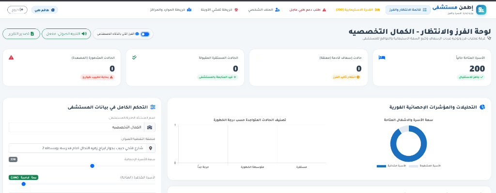

* **خيارات الفرز التلقائي بالذكاء الاصطناعي والتنبيهات (AI Triage & Voice Alert Controls):**  
  أدوات التحكم المتقدمة لتمكين أو تعطيل الفرز الآلي للطلب عبر الذكاء الاصطناعي، وتفعيل التنبيه الصوتي للحالات الحرجة القادمة وتصدير التقارير.
  

* **خريطة تتبع الإسعاف المباشرة وقناة اتصال الإدارة (Live Ambulance Radar & Crisis Help Center):**  
  عرض جغرافي مصغر لسيارات الإسعاف المتوجهة للمستشفى، بالتكامل مع لوحة إرسال طلبات الدعم الطبي العاجل وتجهيزات غرف الكوارث المركزية.
  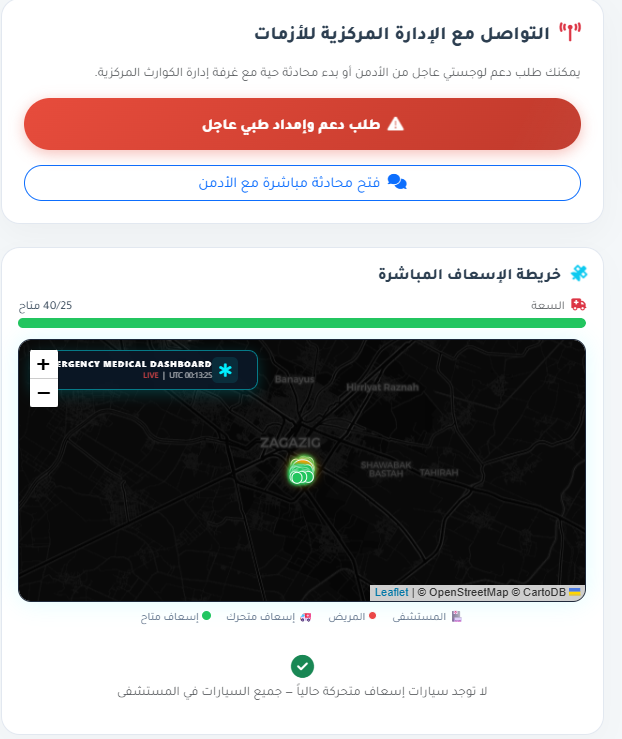

* **تصنيفات وقوائم فرز الحالات الطارئة (Triage Queues & Emergency Categories):**  
  تقسيم الحالات الطارئة في المستشفى إلى تبويبات منظمة (طلبات إسعاف عامة، استقبال مباشر، حالات مقبولة ونشطة، حالات متدهورة/حرجة) مع خيارات البحث والفرز.
  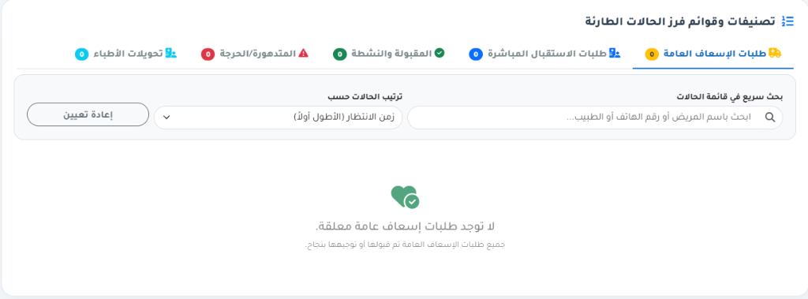

* **نافذة تأكيد إرسال طلب الدعم الطبي العاجل (Urgent Medical Support Confirmation Modal):**  
  شاشة تأكيد يحدد فيها موظف المستشفى إرسال بلاغ عاجل وفوري للإدارة المركزية للأزمات لطلب إمدادات طبية وتجهيزات وأسرة إضافية في حالات النقص الحاد.
  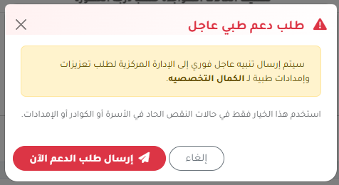

### 🔑 رحلة تسجيل حساب طبيب وتفعيله بالبريد الإلكتروني (Doctor Registration & Email Activation Flow)
* **شاشة تحديد نوع وتصنيف الحساب بالمنصة (Account Type Selection):**  
  واجهة الاختيار الرئيسية للبدء في التسجيل كطبيب لإدارة المرضى والعيادات، أو كمريض لحجز الاستشارات الطبية وتتبع العلامات الحيوية.
  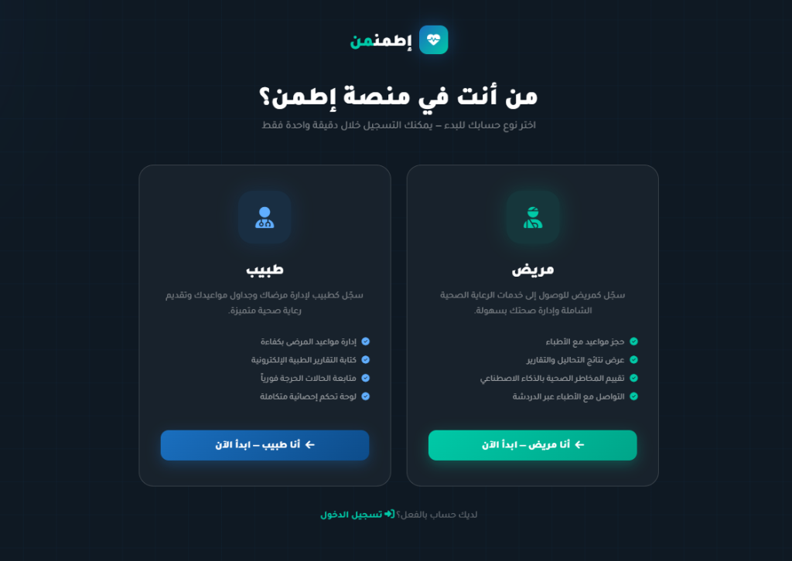

* **نموذج تسجيل بيانات حساب طبيب جديد (Doctor Account Registration Form):**  
  صفحة إدخال البيانات الشخصية والمهنية للطبيب، والبريد الإلكتروني، ورقم الهاتف، وكلمة المرور مع مؤشر قوة كلمة المرور والتحقق من المدخلات.
  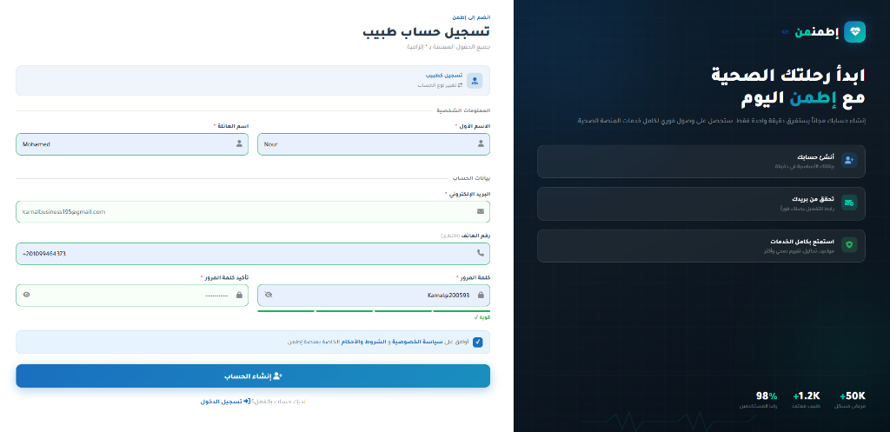

* **تنبيه إرسال رابط التحقق للبريد الإلكتروني (Email Verification Notice Page):**  
  صفحة توجيهية للمستخدم بعد اكتمال التسجيل، تنبهه بضرورة التحقق من صندوق البريد الخاص به لتفعيل حسابه عبر الرابط المرسل.
  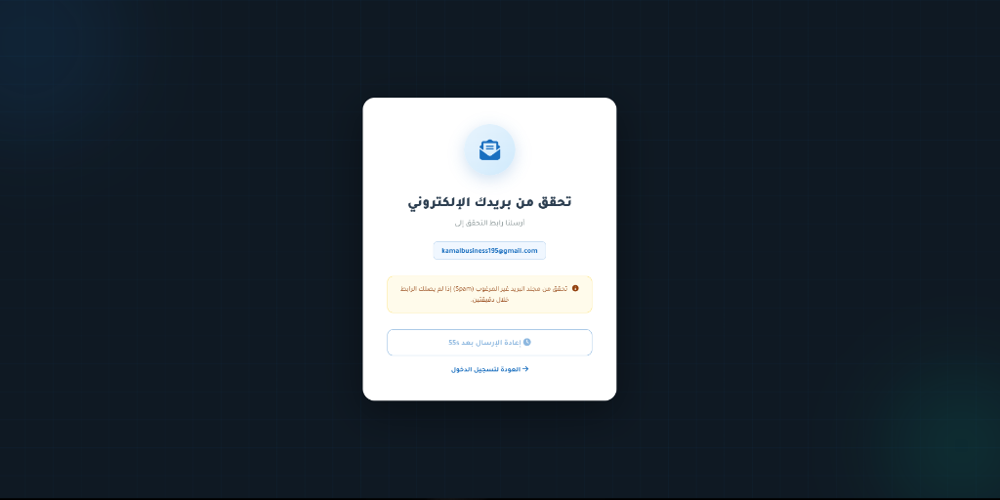

* **رسالة تفعيل الحساب المستلمة عبر البريد (Account Activation Email Template):**  
  تصميم رسالة البريد الإلكتروني الرسمية والمنسقة المرسلة تلقائياً للمستخدم لتأكيد الهوية وتفعيل الحساب بضغطة زر.
  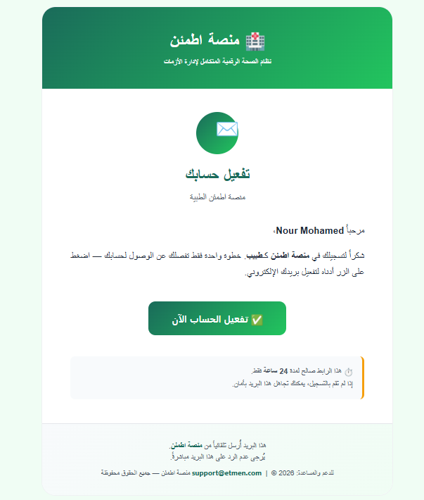

* **شاشة تأكيد تفعيل الحساب والبريد الإلكتروني بنجاح (Successful Email Verification Screen):**  
  واجهة النهاية السعيدة التي تؤكد للمستخدم نجاح عملية التحقق من بريده الإلكتروني وتدعو للانتقال لشاشة تسجيل الدخول وبدء استخدام المنصة.
  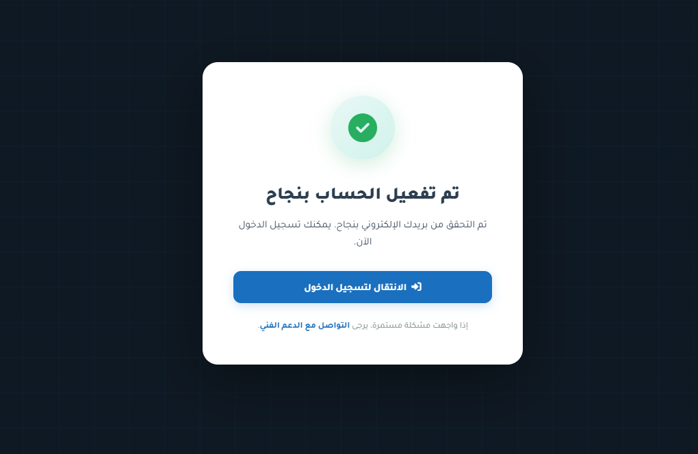

### 🩺 رحلة إعداد حساب الطبيب والعيادة الذكية وتفعيل الخدمات (Doctor Profile & Smart Clinic Onboarding)
* **إدخال البيانات الشخصية والمهنية للطبيب (Doctor Personal Data Form):**  
  الخطوة الأولى في إعداد الحساب حيث يقوم الطبيب برفع صورته الشخصية وتأكيد اسمه ورقم جواله والبريد الإلكتروني والتخصص الطبي الدقيق.
  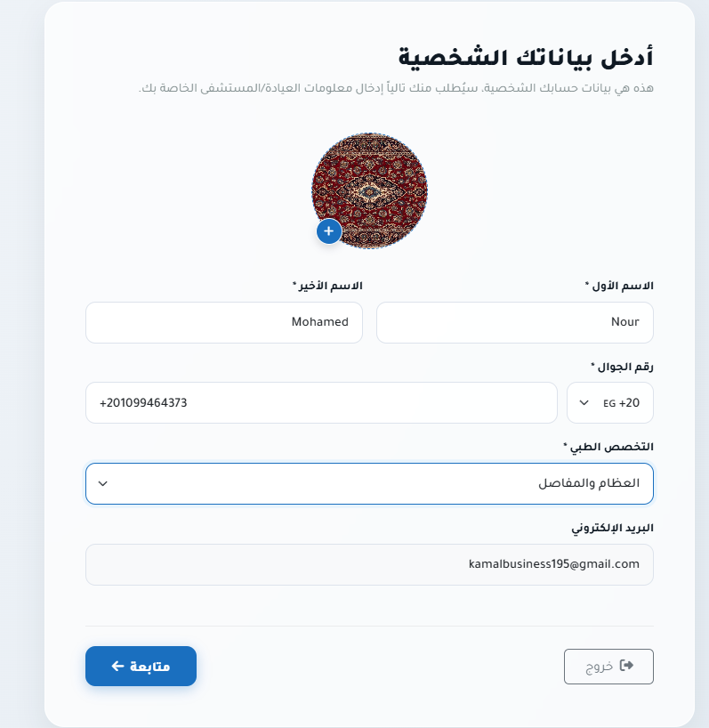

* **إنشاء المنشأة الطبية للعيادة (Create Medical Facility):**  
  واجهة مخصصة للطبيب لتعريف عيادته الذكية أو منشأته الطبية الأولى برفع شعارها وتحديد نوعها واسمها التجاري (مثل عيادة الأمل 2).
  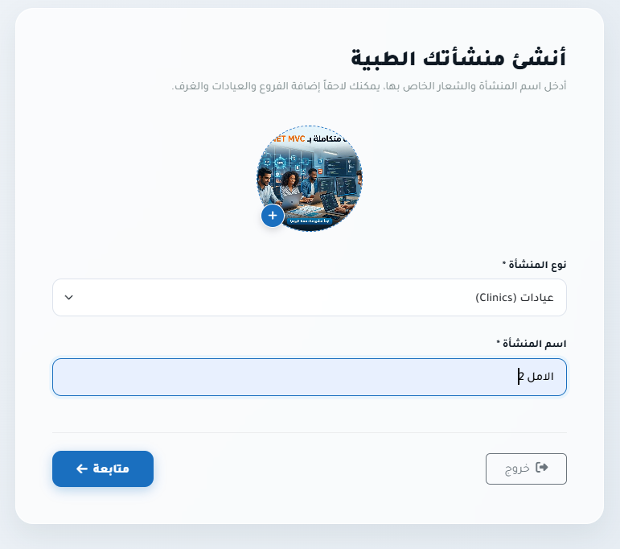

* **الاشتراك في منتجات وخدمات إطمن بوك (Subscribe to Etmen Book):**  
  شاشة استعراض والاشتراك في المنتجات الطبية الرقمية المتاحة للطبيب لتفعيل الحجز الإلكتروني الفوري وتسهيل تواصل المرضى مع عيادته.
  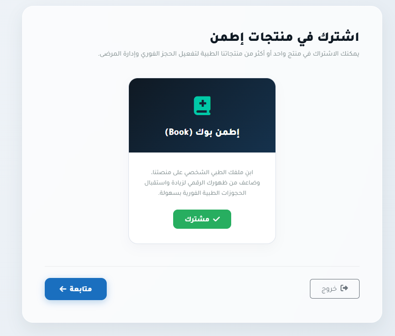

* **تهيئة إعدادات الخدمة وتحديد الموقع الجغرافي للعيادة (Etmen Book Service Setup & Map Location):**  
  شاشة إعداد نظام تسعير الكشوفات والعمولات وتعريف الفرع وتفاصيل السجل التجاري والبطاقة الضريبية وتحديد الموقع بدقة على الخريطة التفاعلية.
  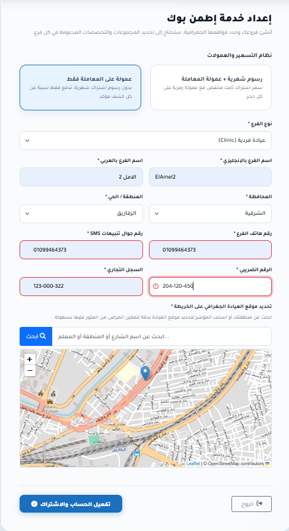

* **لوحة التحكم الذكية لعيادة الطبيب (Doctor Smart Clinic Dashboard):**  
  لوحة المتابعة الشاملة للطبيب وتعرض مواعيد اليوم، وإجمالي المرضى، وتقييم العيادة، وحالة طابور العيادة المباشر لتسجيل وتوجيه المرضى بالانتظار.
  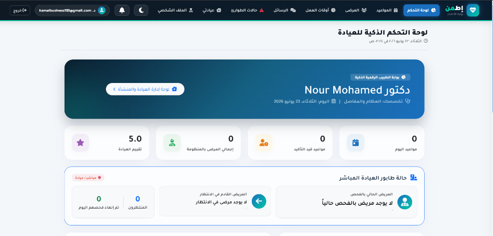

* **الملف الشخصي المهني وتعديل السيرة الذاتية (Doctor Professional Profile & CV):**  
  واجهة تتيح للطبيب تحديث بيانات ترخيص مزاولة المهنة ورقم النقابة ورسوم الكشف وتعديل السيرة الذاتية المهنية وتفاصيل التخصص.
  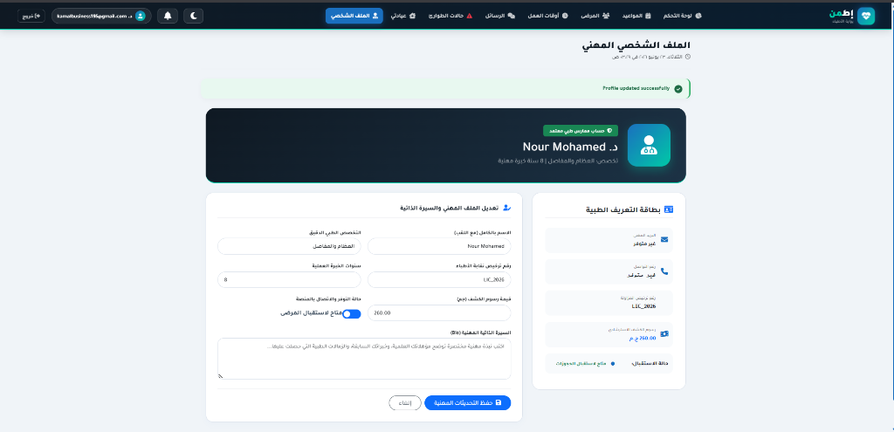

* **شاشة تفاصيل عيادتي وإدارة طاقم العمل (My Clinic Details & Staff):**  
  لوحة استعراض بيانات العيادة الكاملة وتضم إجمالي الحجوزات والفترات المتاحة وطاقم موظفي الاستقبال والتمريض مع عرض الموقع الجغرافي للعيادة.
  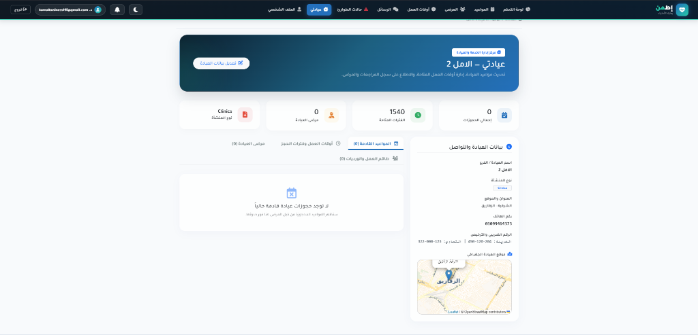

* **لوحة تحليلات ورسوم إحصائيات المواعيد (Doctor Appointment Analytics Dashboard):**  
  لوحة عرض إحصائية متكاملة لرسوم بيانية توضح توزيع حالات الحجوزات (مكتملة، ملغاة، مؤكدة)، ومعدل الحجوزات الأسبوعي، وتحديد ساعات ذروة الحجوزات لتسهيل إدارة التشغيل.
  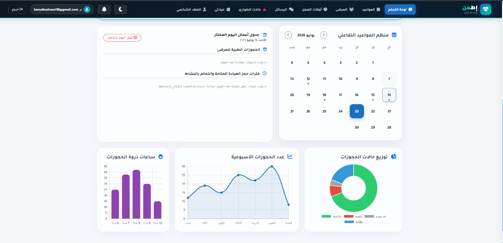

* **واجهة إضافة فترات العمل المتعددة (Add Multiple Time Slots Form):**  
  نافذة منبثقة تتيح للطبيب أو موظف الاستقبال توليد فترات حجز متكررة تلقائياً بتحديد تاريخ البداية والنهاية، والوردية اليومية، ومدة الكشف بالدقائق.
  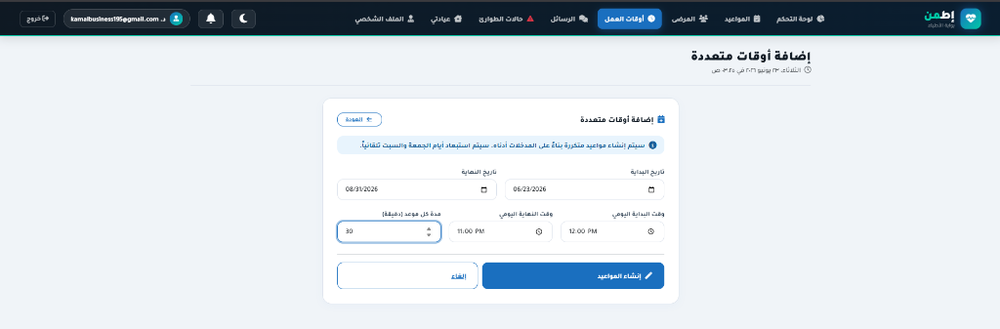

* **منظم المواعيد التفاعلي والتحكم في فترات الحجز (Interactive Appointment Planner & Slots Toggle):**  
  واجهة لتفعيل وتعطيل فترات الحجز الزمنية حياً عن طريق منزلقات النشاط (متاح / غير متاح) لتنظيم فترات استقبال المرضى بالعيادة.
  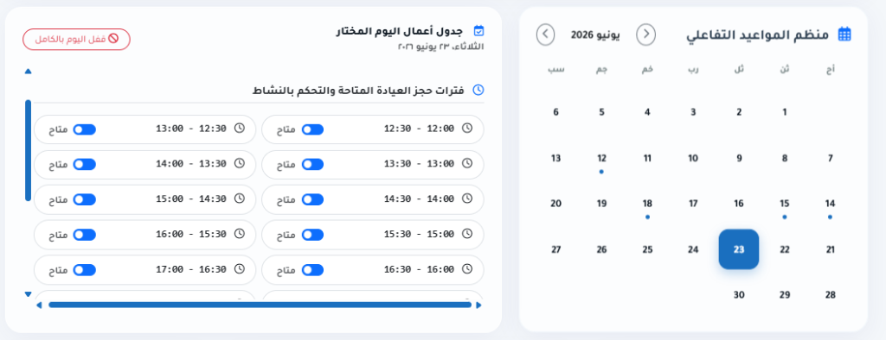

* **إدارة وجدول فترات عمل الطبيب المتاحة (Manage Work Hours Slots List):**  
  واجهة عرض جدول فترات العمل التفصيلية بالتواريخ والساعات لمعاينتها أو حذفها وتعديلها الفردي لضمان مرونة الجدول اليومي.
  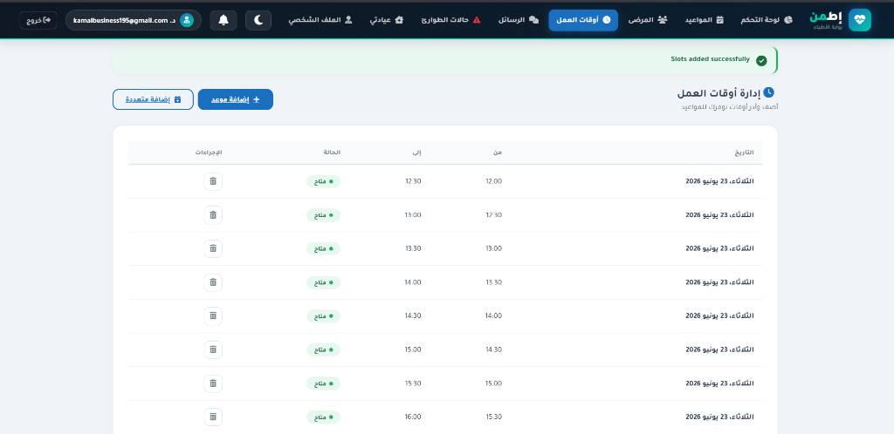

* **بوابة الرسائل والاستشارات الفورية (Direct Messaging & Consultations Portal):**  
  مركز اتصال مباشر يربط الطبيب بالمرضى ومختلف الطواقم الطبية لتقديم الاستشارات النصية السريعة ومتابعة التحاليل والتقارير الطبية.
  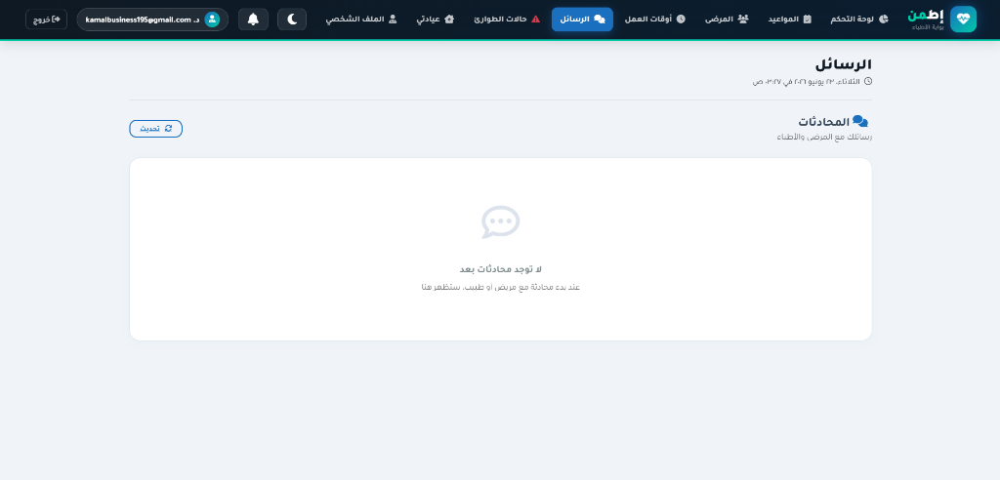

* **صندوق تنبيهات حالات الطوارئ الطبية الحرجة (Emergency & Crisis Inbox):**  
  شاشة متابعة مخصصة لاستلام إشعارات حالات الطوارئ العاجلة المحولة لعيادة الطبيب للمتابعة الفورية والتأهب المسبق لاستقبالها.
  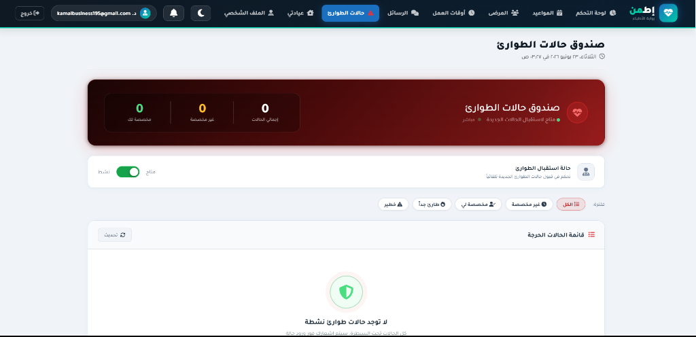

### 🚑 رحلة المريض، التقييم الذكي للمخاطر وإدارة الطوارئ (Patient Journey, AI Risk Assessment & Emergency Flow)
* **الملف الطبي التعريفي للمريض (Patient Medical Profile):**  
  شاشة استعراض وتحديث بيانات المريض الأساسية وتاريخ الميلاد وفصيلة الدم والطول والوزن وتفاصيل الاتصال بالمنصة.
  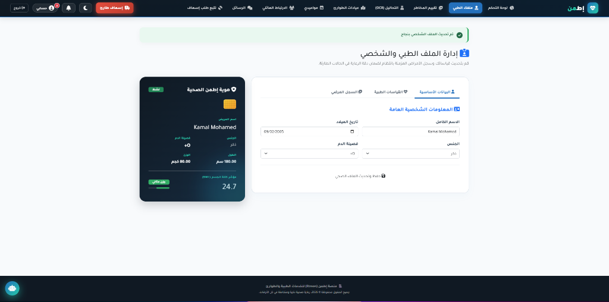

* **نموذج التقييم الذكي للمخاطر والأعراض (Symptom & Risk Assessment Form):**  
  استمارة تفاعلية يملأها المريض لتحديد الأعراض الحالية وعلاماته الحيوية لتشخيص فئة الخطر وتوجيه الرعاية المناسبة.
  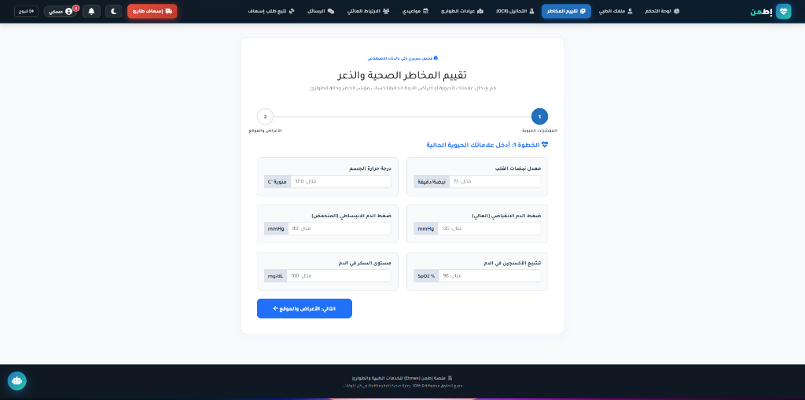

* **شاشة نتيجة تقييم المخاطر الطبية (Risk Assessment Result):**  
  واجهة عرض نتيجة تشخيص الأعراض وحساب فئة الخطر ونسبة احتمالية الإصابة بالمرض أو الوباء مع توجيهات طبية فورية.
  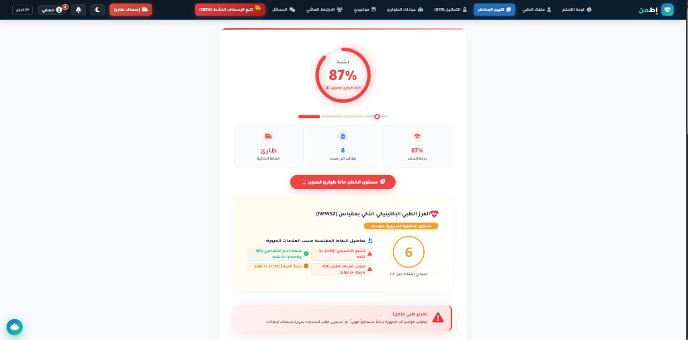

* **تفاصيل تقييم المخاطر والأعراض المكتشفة (Risk Evaluation Details):**  
  عرض تحليلي تفصيلي يوضح درجات الخطورة المرتبطة بكل عرض تم إدخاله وتوصيات العزل أو زيارة الطبيب الفورية.
  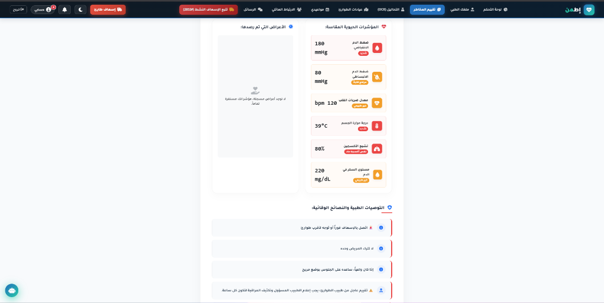

* **السجل الطبي والملف الصحي التاريخي للمريض (Patient Medical History Summary):**  
  صفحة تعرض تاريخ الفحوصات والتشخيصات السابقة للمريض، والعمليات الجراحية، والأمراض المزمنة، وتاريخ العائلة الطبي.
  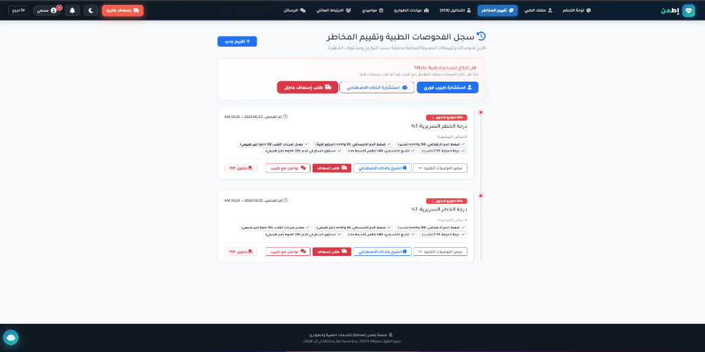

* **الفحص الذكي للتحاليل والتقارير الطبية بالـ OCR (AI Medical OCR Analyzer):**  
  شاشة تتيح للمريض تحميل صور تقارير التحاليل الطبية والروشتات ليقوم محرك الذكاء الاصطناعي باستخراج وتحليل القراءات الطبية تلقائياً.
  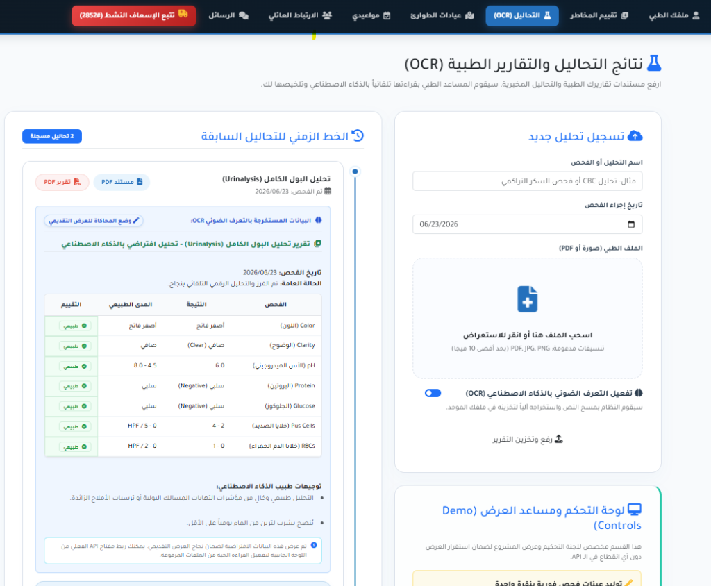

* **خريطة المستشفيات والمنشآت الطبية الأقرب (Nearby Hospitals & Medical Facilities Map):**  
  خريطة تفاعلية تحدد موقع المريض الجغرافي وتعرض أقرب المستشفيات المتاحة وحالة السعة الاستيعابية لغرف الطوارئ بها.
  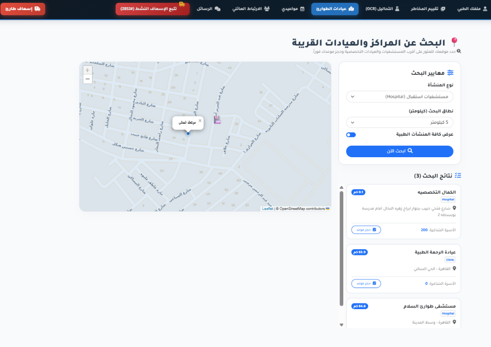

* **تقديم طلب نقل إسعاف واستغاثة طارئة (Emergency Ambulance Dispatch Request):**  
  واجهة فورية تتيح للمريض أو ذويه إرسال طلب استغاثة عاجل لسيارة الإسعاف مع مشاركة إحداثيات الموقع وتفاصيل الحالة الصحية تلقائياً.
  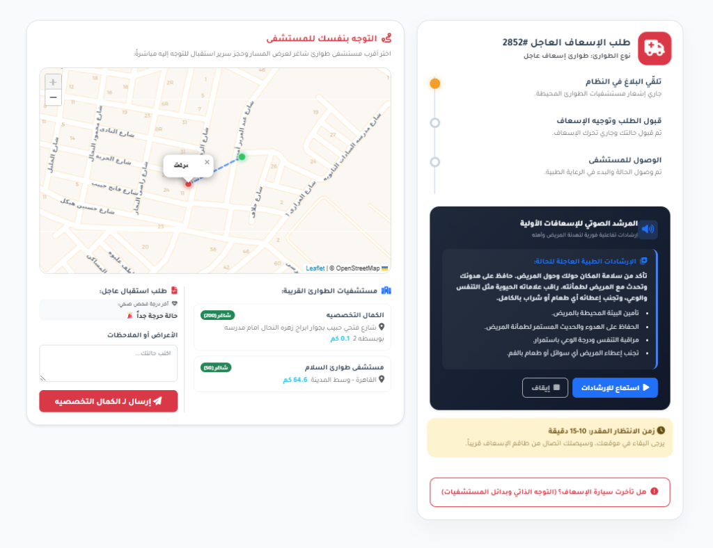

* **الملف الصحي للحالة الطارئة في المستشفى (Hospital Emergency Admission File):**  
  ملف مخصص لطاقم الطوارئ بالمستشفى يعرض بيانات المريض المحول والتقييم الأولي وحالته الحيوية فور وصول سيارة الإسعاف.
  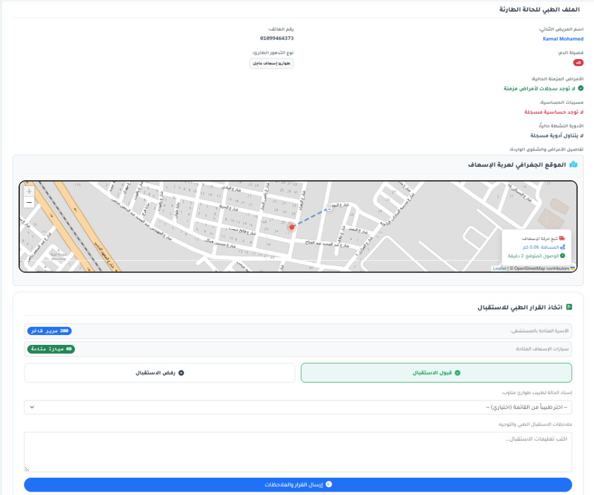

* **تتبع مباشر لسيارة الإسعاف وخريطة الوصول (Live Ambulance GPS Tracking):**  
  شاشة تفاعلية تتيح للمريض أو المستشفى تتبع حركة سيارة الإسعاف المتوجهة إليهم بشكل حي وتحديد زمن الوصول المتوقع (ETA).
  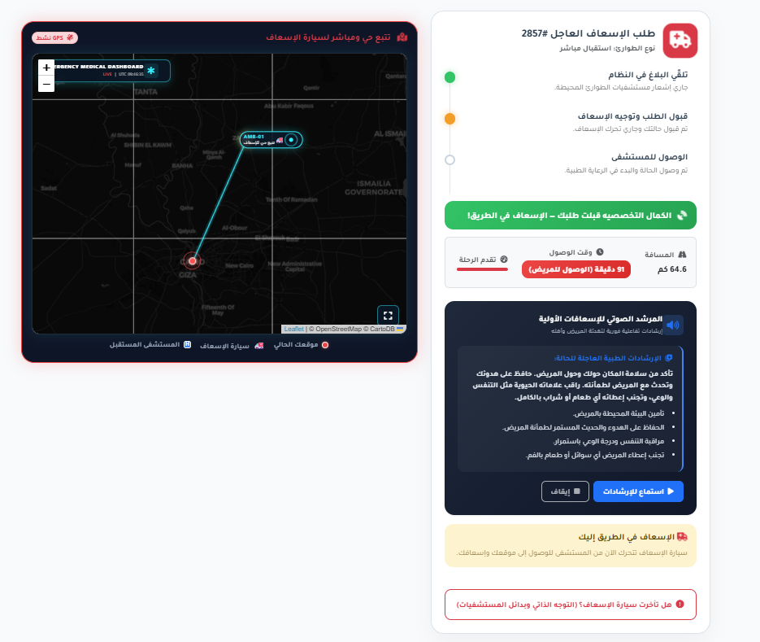

* **قائمة طوابير وفرز حالات الطوارئ للطبيب (Doctor Triage Emergency Queue):**  
  لوحة الطبيب لمتابعة الحالات الطارئة النشطة والقادمة مرتبة حسب الأولوية الطبية ودرجة خطورة التشخيص لفرزها بدقة.
  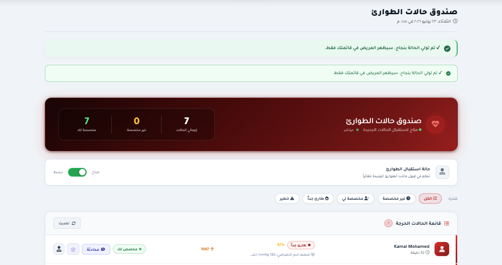

* **لوحة تحكم المريض أثناء حالة الطوارئ (Patient Emergency Status Dashboard):**  
  واجهة مخصصة تعرض للمريض حالة طلبه الحالي ونوع سيارة الإسعاف واسم المسعف وقناة الاتصال المباشر مع طاقم النجدة.
  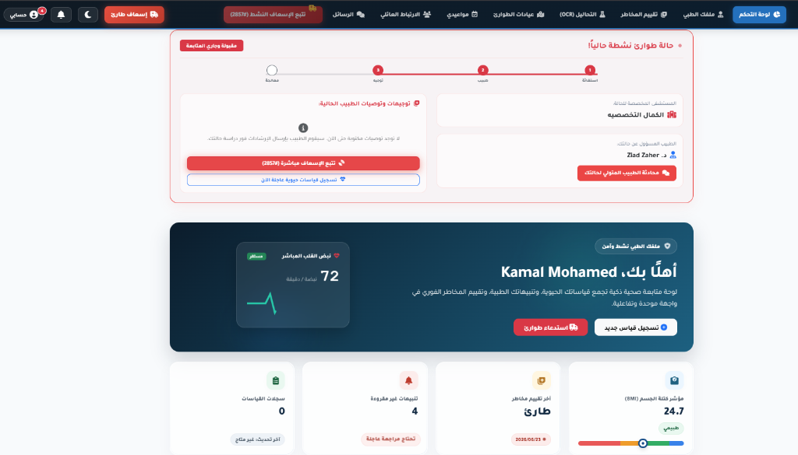

* **المحادثة الفورية بين الطبيب والمريض (Direct Doctor-Patient Chat):**  
  نافذة دردشة مباشرة وآمنة تتيح للمريض التواصل مع الطبيب المتابع للاستشارة السريعة أو إرسال الاستفسارات بخصوص الحالة.
  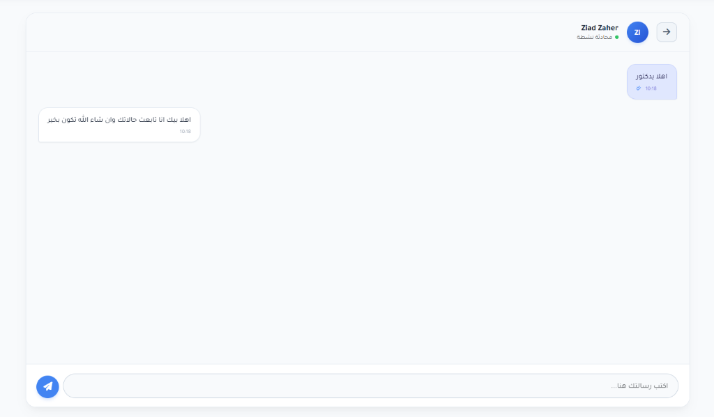

* **المستشار الطبي الذكي بالذكاء الاصطناعي (AI Virtual Health Assistant Chatbot):**  
  واجهة تفاعلية حية للتحدث مع مساعد إطمن الذكي المدعوم بالذكاء الاصطناعي للحصول على استشارات صحية وتفسير الأعراض بالوقت الفعلي.
  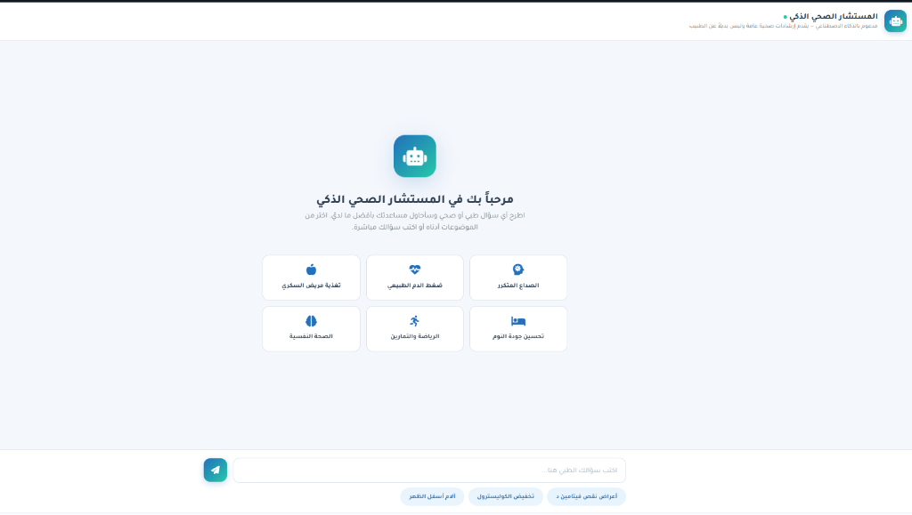

* **تفاصيل حالة الطوارئ والتقييم السريري (Emergency Case Clinical Details):**  
  شاشة تفصيلية يعرض فيها الطبيب سجل العلامات الحيوية للحالة وتوقيت التدخل والإسعافات الأولية المقدمة داخل سيارة الإسعاف.
  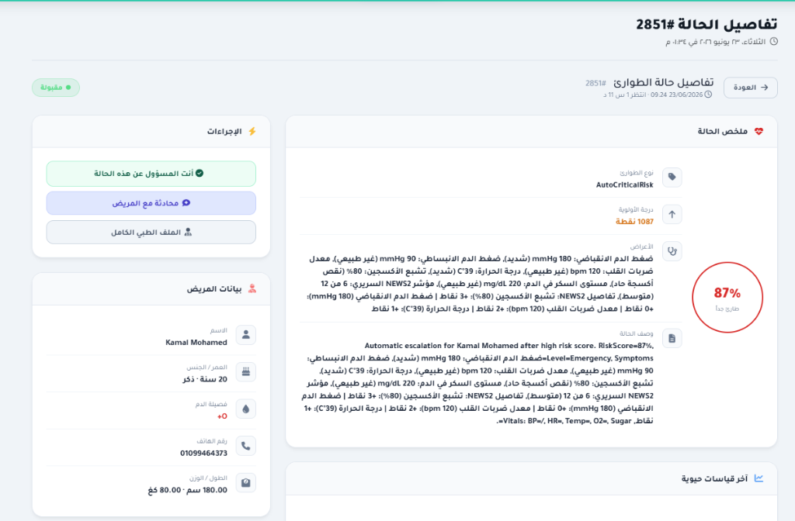

* **توصيات الطبيب والوصفة الطبية الإرشادية (Doctor Recommendations & Treatment Plan):**  
  التقرير الختامي للمريض ويشمل توصيات الطبيب المعالج والجرعات الدوائية الموصوفة والروشتة الرقمية لمتابعة التعافي.
  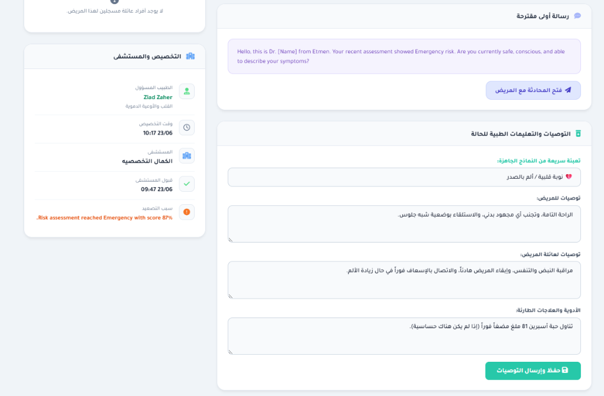

* **تقرير تسليم الحالة الطارئة للمستشفى (Emergency Delivery & Handover Report):**  
  واجهة تسليم رسمية تسجل حالة المريض الطبية الدقيقة عند تسليمه من طاقم الإسعاف لغرفة الطوارئ بالمستشفى لضمان استمرارية الرعاية.
  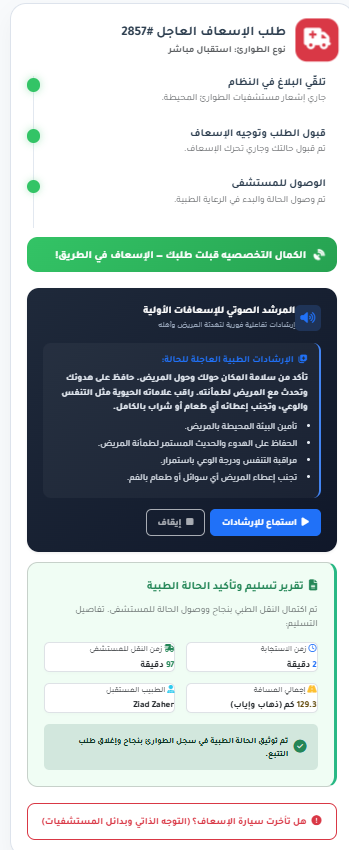

* **لوحة مراقبة وتتبع المؤشرات الحيوية للمريض (Patient Vitals Monitoring Dashboard):**  
  لوحة تحكم شخصية تتيح للمريض إدخال ومراقبة تطور مؤشراته الحيوية (مثل ضغط الدم، السكر، النبض، ودرجة الحرارة) بالرسوم البيانية.
  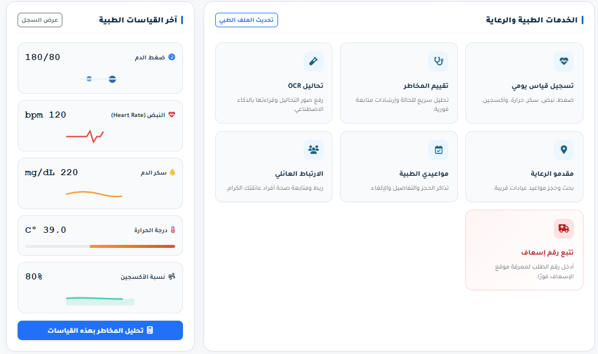

* **سجل الاستشارات وحجوزات المريض السابقة (Patient Bookings & Consultations History):**  
  أرشيف متكامل لجميع حجوزات العيادات السابقة للمريض وتقارير الزيارات والاستشارات الطبية التي أجراها عبر المنصة.
  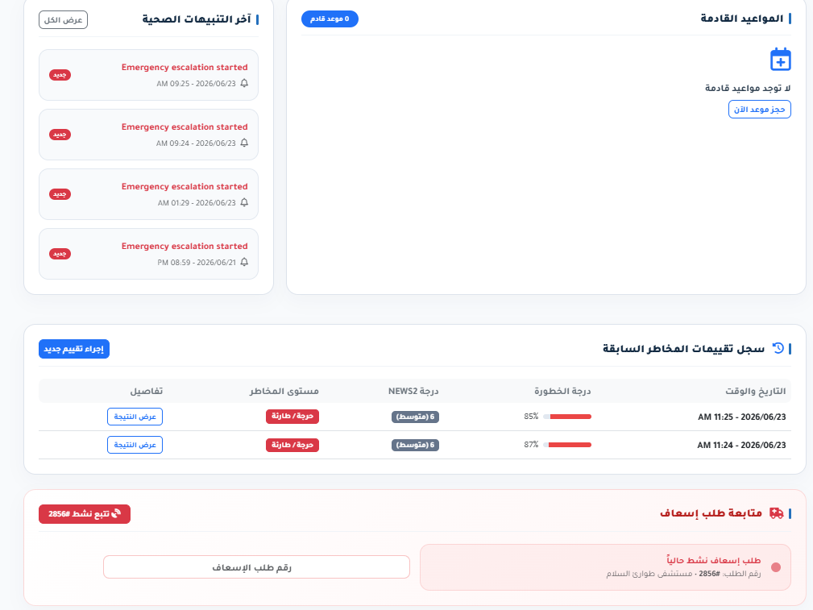

### 📅 رحلة حجز المواعيد وإصدار تذاكر الكشف الطبي (Doctor Appointment Booking & Ticket Management Flow)
* **الأطباء المتاحون بالمنشأة الطبية (Available Doctors in Facility):**  
  شاشة استعراض الأطباء المتاحين داخل المستشفى أو المركز الطبي، مع إظهار تفاصيل التخصص، وسنوات الخبرة، ورسوم الكشف، وتقييمات المرضى وزر الحجز المباشر.
  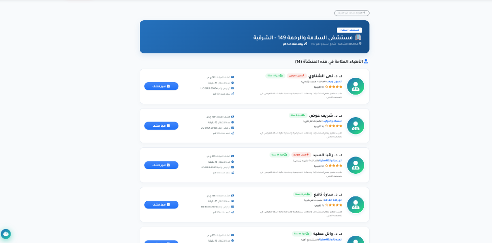

* **لوحة اختيار وحجز موعد الكشف (Doctor Booking & Appointment Picker):**  
  واجهة الملف الشخصي للطبيب وتفاصيل العيادة، وتضم لوحة تفاعلية لاختيار اليوم والوردية والميعاد المتاح للحجز الفوري بسهولة.
  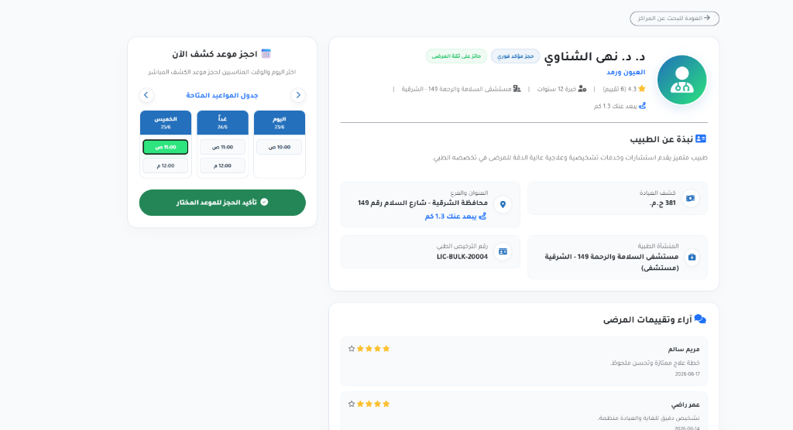

* **لوحة المواعيد القادمة في حساب المريض (Patient Upcoming Appointments Dashboard):**  
  شاشة متابعة المواعيد المجدولة والاستشارات الطبية للمريض، وتضم تفاصيل الطبيب وتوقيت الحجز وخيارات عرض تذكرة الكشف أو الإلغاء.
  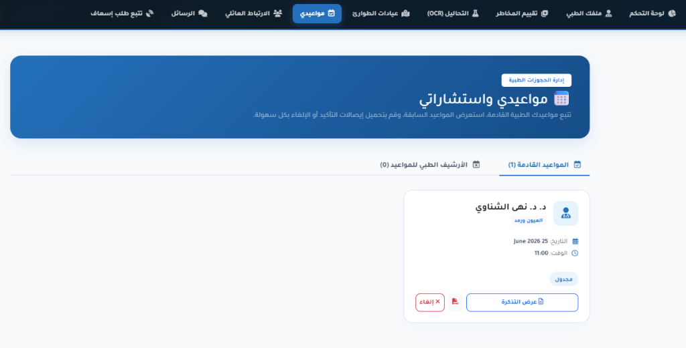

* **تذكرة الموعد الطبي الإلكترونية (Medical Appointment E-Ticket):**  
  وثيقة تذكرة الكشف الرقمية المنسقة، وتضم تفاصيل الموعد، وتوقيت الحضور، ورمز الحجز (ETM) الفريد، مع الباركود وتسهيل تحميل التذكرة كملف PDF.
  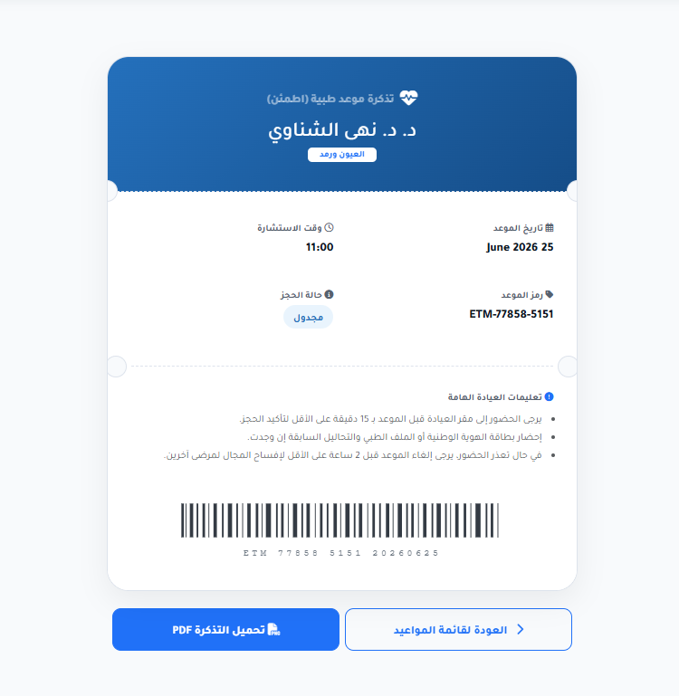

* **التحديث الفوري واختفاء الموعد المحجوز (Booked Time Slot Auto-Removal):**  
  تأكيد الحجز اللحظي يضمن إخفاء وإلغاء الفترة الزمنية المحددة تلقائياً من جدول مواعيد الطبيب لمنع تعارض الحجوزات أو تكرارها.
  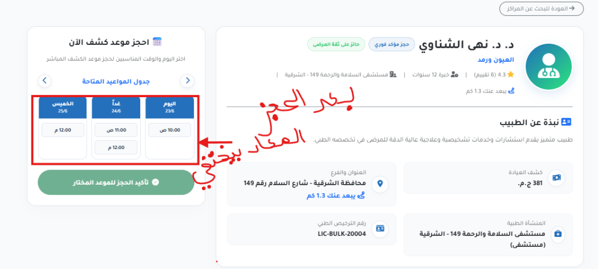

### 👨‍👩‍👧‍👦 إدارة الارتباط العائلي وتتبع حالات الطوارئ عن بُعد (Family Link & Remote Emergency Monitoring Flow)
* **إرسال دعوة ارتباط عائلي جديدة (Send Family Connection Invitation):**  
  شاشة إدخال البريد الإلكتروني للمستقبل، وتحديد صلة القرابة (أب، ابن، أخ، إلخ)، واختيار الصلاحيات الطبية الممنوحة للقريب (مثل الاطلاع على الملف الطبي، وتلقي إشعارات الطوارئ، وحجز المواعيد نيابة عنه).
  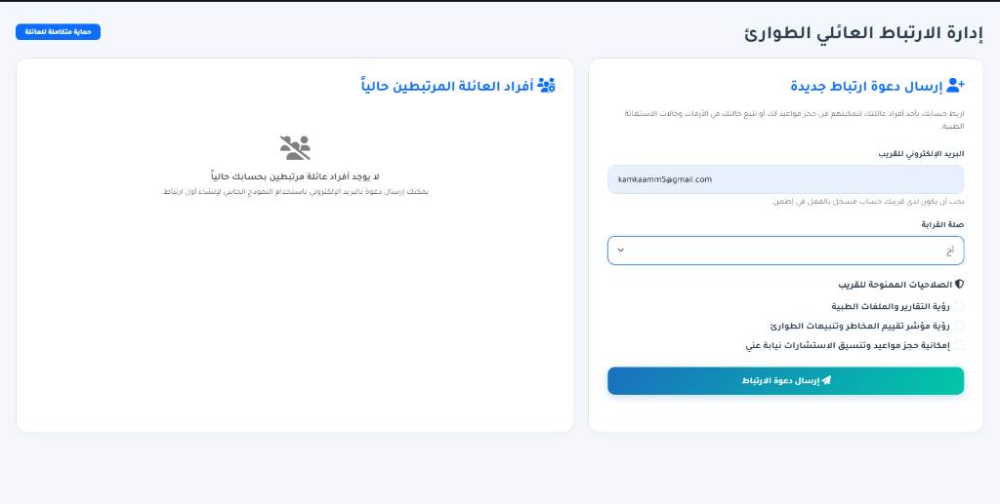

* **إدارة دعوات الارتباط العائلي قيد الانتظار (Manage Pending Family Invitations):**  
  شاشة استعراض الطلبات المرسلة للأقارب والتي لا تزال بانتظار موافقتهم، وتضم بيانات القريب وحالته، وخيار إلغاء الدعوة فوراً.
  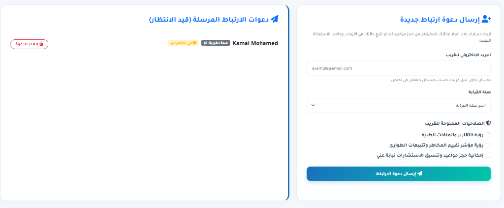

* **طلبات الارتباط العائلي الواردة للموافقة (Review Incoming Family Connections):**  
  واجهة مخصصة تتيح للمستخدم مراجعة طلبات الربط العائلي الواردة من أقاربه، واستعراض الصلاحيات الطبية المطلوبة، وقبول الطلب أو رفضه.
  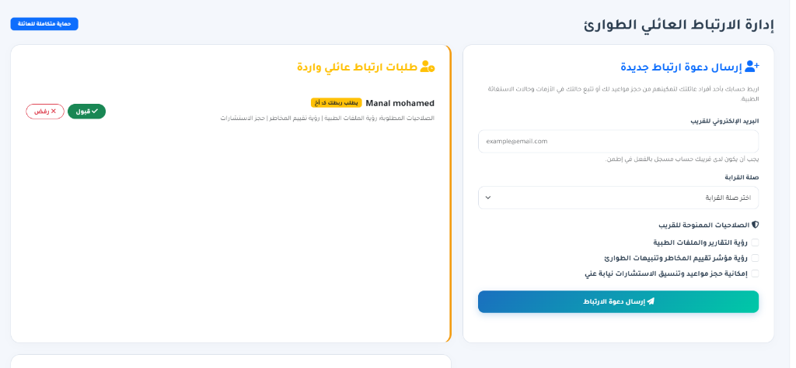

* **لوحة مراقبة العلامات الحيوية وطوارئ القريب عن بُعد (Remote Vitals & Emergency Tracker):**  
  شاشة رصد ذكية متكاملة يعرض فيها القريب المؤشرات الحيوية المفصلة لقريبه (نبض، سكر، حرارة، أكسجين) ورسومها البيانية، مع تتبع حالة الطوارئ النشطة بالمستشفى المحال إليها، واسم الطبيب، وتوصيات الطوارئ للمريض والأسرة، وأيقونة المحادثة الفورية مع الطبيب.
  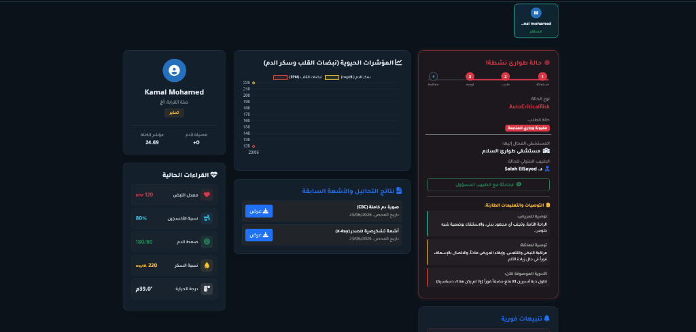

* **التنبيهات الفورية وخريطة تتبع القريب الطارئة (Instant Alerts & Remote Patient Location Map):**  
  شاشة استعراض تنبيهات الاستغاثة النشطة الخاصة بالقريب، وموقعه الجغرافي المباشر بالـ GPS على الخريطة التفاعلية، مع خيارات الاتصال الفوري بالإسعاف، وفتح محادثة استغاثة طارئة لمساندته.
  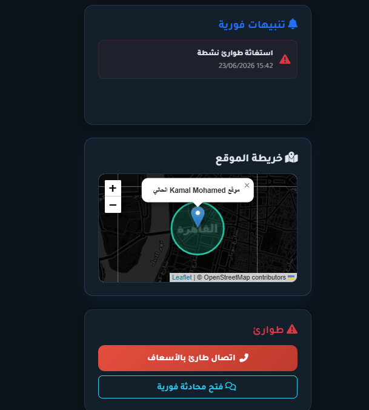

---


## ⚠️ التحديات التي واجهتنا أثناء التنفيذ
خلال مرحلة بناء وتطوير نظام **إطمن**، واجهنا مجموعة من التحديات الهندسية والتقنية الصعبة، وتمكننا بفضل التخطيط الجيد وتوجيهات المبادرة من التغلب عليها بالكامل:

1. **إدارة تداخل الصلاحيات المتعددة والتأمين الذكي (Multi-Role Conflict Management):**
   * *التحدي:* يحتوي النظام على 5 أدوار مختلفة تتداخل صلاحياتها في بعض العمليات (مثل استقبال بلاغات الطوارئ ومراجعة السجلات الطبية).
   * *الحل:* قمنا ببناء معمارية قائمة على السياسات والأدوار الهرمية في ASP.NET Core Identity، وتأمين كافة الـ Actions على مستوى الكنترولرات وتوظيف الـ Custom Filters للتوجيه التلقائي للمستخدمين غير مكتملي البيانات الشخصية.
2. **مزامنة البيانات الحية بالوقت الفعلي (Real-Time Communication):**
   * *التحدي:* تحديث طابور الطوارئ وإشغال أسرة المستشفيات وغرف العناية المركزة بشكل فوري دون دفع موظفي الطوارئ لعمل تحديث مستمر للصفحة، مما قد يؤخر الاستجابة.
   * *الحل:* قمنا بالتكامل مع تقنية **SignalR Hubs** لإنشاء قنوات اتصال ثنائية الاتجاه (`ChatHub`, `QueueHub`, `EmergencyHub`)، تضمن دفع التحديثات تلقائياً لكافة المتصلين بمجرد إجراء أي تعديل أو إرسال بلاغ استغاثة.
3. **تنظيم الهيكل الداخلي وتفادي تعارضات الدمج (Merge Conflicts):**
   * *التحدي:* عمل 5 مطورين بالتوازي على مشروع ضخم يحتوي على 29 كنترولر وعشرات النماذج والخدمات في بيئة عمل Git مشتركة كان كفيلاً بإحداث تعارضات مستمرة تعيق التقدم.
   * *الحل:* تم تطبيق **Controller Division Plan** دقيقة جداً تفصل نطاق عمل كل مطور في الكنترولرات والواجهات، واستخدام فروع Git مخصصة للميزات (Feature Branches) مع مراجعة الكود الجماعية قبل أي عملية دمج في الفرع الرئيسي لضمان استقرار البناء البرمجي بنسبة 100%.
4. **تكامل محرك الذكاء الاصطناعي وقراءة المستندات (AI Chatbot & OCR):**
   * *التحدي:* استخراج القيم والعلامات الحيوية الشاذة من صور التحاليل المرفوعة بواسطة المرضى بشكل آمن وبصيغ مختلفة.
   * *الحل:* تم بناء طبقة وسيطة في الـ BLL تستقبل الملفات المرفوعة وتمررها لمحرك المعالجة وقراءة النصوص البصرية OCR، ثم معالجة المخرجات النصية وتصفيتها واستخلاص القيم الرقمية لمطابقتها مع الحدود الطبية الآمنة وتوجيهها للمساعد الطبي الذكي.

---

## 🔮 الأفكار والتطويرات المستقبلية
يسعى فريق عمل **إطمن** إلى تطوير المنصة في المراحل القادمة لتصبح نظاماً صحياً وطنياً شاملاً عبر الميزات التالية:
* 🗺️ **التكامل مع خرائط Google وتتبع نظام تحديد المواقع (GPS Live Tracking):** تتبع سيارات الإسعاف جغرافياً على الخريطة وتحديد الوقت المتوقع للوصول (ETA) بناءً على حركة المرور اللحظية.
* ⌚ **التكامل مع الأجهزة القابلة للارتداء (Wearable Devices Integration):** ربط المنصة بالساعات الذكية (أبل وسامسونج وغيرها) لسحب المؤشرات الحيوية ونبضات القلب ومستوى الأكسجين بشكل آلي ومستمر وتنبيه الطوارئ فوراً في حال حدوث أي خطر مفاجئ أو سقوط للمريض.
* 📱 **تطوير تطبيقات الهواتف الذكية (Mobile Apps):** إطلاق تطبيقات أصلية (Native Mobile Applications) لنظامي Android و iOS باستخدام تقنيات Flutter أو .NET MAUI لتسهيل وصول المرضى لخدمة الاستغاثة الفورية بضغطة زر من هواتفهم.
* 🧠 **التعلم الآلي المتقدم (Predictive Health Analytics):** بناء وتدريب نماذج تعلم آلي مخصصة للتنبؤ بالأزمات الصحية الفردية للمرضى وتوقع حدوث الأوبئة في مناطق جغرافية معينة قبل انتشارها الفعلي بناءً على الذكاء الاصطناعي التنبؤي.

---

## 👥 أعضاء الفريق وتوزيع المهام
يتكون فريق العمل من خمسة مطورين متميزين من خريجي مبادرة DEPI. وقد تم تقسيم العمل وتوزيع المهام كالتالي:

### 🥇 كمال محمد صابر (Kamal Mohamed Saber) - قائد المشروع ومعماري النظام والمسؤول عن الأزمات والطوارئ والذكاء الاصطناعي والخرائط التفاعلية (Project Lead & System Architect)
* **المسؤوليات والمهام التفصيلية في التطوير:**
  * **تأسيس البنية المعمارية للنظام (System Architect):** التخطيط الهندسي وتأسيس المشروع بالكامل وفق نمط (Clean Architecture) لربط وتكامل المشاريع الأربعة الأساسية، وإعداد سياق البيانات الرئيسي `EtmenDbContext` وتطبيق الـ Migrations، وإنشاء مستودعات البيانات العامة (`GenericRepository` و `UnitOfWork` و `BLLMappingProfile` عبر Mapster).
  * **المنظومة الجغرافية والخرائط الذكية التفاعلية (Geographical System):** تطوير وتكامل كافة الخرائط التفاعلية حية المصدر بالنظام، بما في ذلك خريطة تتبع سيارات الإسعاف اللحظية وجدول إحداثيات `GetActiveDispatchMap` ومزامنتها عبر الـ Hubs، وخريطة بؤر انتشار الأوبئة والأزمات (Crisis Heatmap)، وخريطة أقرب مستشفى ومقدم خدمة للمرضى (Nearby Providers Finder Map)، والمسار الجغرافي الشامل للشبكة الطبية (Telemetry Map).
  * **مركز التحكم بالأزمات والأوبئة (Crisis Command Center):** بناء نظام مكافحة الأوبئة الوبائية بالكامل، والتحكم بالأعراض وأوزانها الطبية واحتساب معامل التفشي الجغرافي ([AdminCrisisController.cs](Etmen_PL/Controllers/AdminCrisisController.cs)، و `CrisisService.cs` و `CrisisRiskEngineService.cs` و `OutbreakZoneRepository`).
  * **محرك تقييم المخاطر الصحية والفرز الذاتي (Self-Risk Engine):** تطوير الكنترولر المسؤول والخدمات وحسابات مستويات الخطورة الطبية للمرضى ([RiskAssessmentController.cs](Etmen_PL/Controllers/RiskAssessmentController.cs) و `RiskService.cs`).
  * **نظام الطوارئ والاستجابة الطبية الفورية (Emergency Management):** تطوير زر الاستغاثة وتلقي البلاغات الفورية وتتبعها ([EmergencyController.cs](Etmen_PL/Controllers/EmergencyController.cs) و [DoctorPanicInboxController.cs](Etmen_PL/Controllers/DoctorPanicInboxController.cs)، وخدمات الفرز الأوتوماتيكي وتصعيد الحالات الحرجة للمستشفيات القريبة والمستعدة `CriticalCareEscalationService.cs`).
  * **دمج الذكاء الاصطناعي وقراءة التحاليل بصریاً (AI & OCR Integration):** دمج محرك جوجل الاستشاري (`Gemini-1.5-Flash`) في المحادثات الاستشارية الطبية ([ChatbotController.cs](Etmen_PL/Controllers/ChatbotController.cs) و `AIChatService.cs`)، وبرمجة نظام رفع التحاليل الطبية وفك شيفرة نصوصها ومطابقتها مع الحدود الآمنة برمجياً ([LabResultsController.cs](Etmen_PL/Controllers/LabResultsController.cs) و `LabService.cs`).
  * **التحكم والتقارير الإدارية (Admin Dashboards & Systems):** تطوير بوابة إحصائيات الإدارة والنشاط والـ KPIs ([AdminDashboardController.cs](Etmen_PL/Controllers/AdminDashboardController.cs)) وتراخيص الكيانات ([AdminProvidersController.cs](Etmen_PL/Controllers/AdminProvidersController.cs)) وإدارة الحسابات الطبية ([AdminUsersController.cs](Etmen_PL/Controllers/AdminUsersController.cs)) وتصدير تقارير الأداء الطبي في النظام بصيغة PDF وجداول إحصائية ([AdminReportsController.cs](Etmen_PL/Controllers/AdminReportsController.cs)).
  * **إعداد قنوات الاتصال الحي والخدمات الخلفية المجدولة:** إنشاء الـ SignalR Hubs بالكامل (`ChatHub`, `QueueHub`, `EmergencyHub`) ونظام تنبيهات المستخدمين ([AlertsController.cs](Etmen_PL/Controllers/AlertsController.cs))، والـ Identity والأمان والتحقق والتسجيل ([AccountController.cs](Etmen_PL/Controllers/AccountController.cs)).
  * **النشر والرفع والدمج (Deployment & Operations):** الإشراف على عمليات بناء الأكواد، وإدارة دمج فروع العمل، ونشر ورفع المنصة حياً على الويب لتشغيلها على رابط: [https://etmen.runasp.net/](https://etmen.runasp.net/).

### 👥 باقي أعضاء الفريق (مطورين مساعدين في بوابات الأطباء والمرضى)

#### 👤 عبد الحميد أحمد عبد الحميد علي (Abdelhamid Ahmed Abdelhamid Ali)
* **المسؤوليات والمهام التفصيلية في التطوير:**
  * تطوير الملف الشخصي والمهني للطبيب لتسجيل بيانات الترخيص والتخصص الطبي وتفعيلها في قاعدة البيانات ([DoctorProfileController.cs](Etmen_PL/Controllers/DoctorProfileController.cs) والخدمة البرمجية `DoctorService.cs`).
  * تطوير شاشات إعداد بيانات عيادات الطبيب ومواقع تواجدها الجغرافية لربطها بالحجوزات الطبية ونسب التقييمات ([DoctorClinicController.cs](Etmen_PL/Controllers/DoctorClinicController.cs)).

#### 👤 أحمد أحمد محمد محمود (ahmed ahmed mohamed mahmoud)
* **المسؤوليات والمهام التفصيلية في التطوير:**
  * تطوير الكنترولر المشرف على جدولة فترات عمل الطبيب المتاحة للمرضى، وإضافتها بشكل فردي أو إضافة جماعية وتوزيع الفترات الزمنية ([DoctorSlotsController.cs](Etmen_PL/Controllers/DoctorSlotsController.cs)).
  * إدارة وتحديث حالات المواعيد الطبية المحجوزة لدى الأطباء (مقبول، ملغي، قيد الانتظار) وإرسال الإشعارات للطبيب ([DoctorAppointmentsController.cs](Etmen_PL/Controllers/DoctorAppointmentsController.cs)).

#### 👤 عبد الرحمن رشدي حسن عبد العاطي (Abdelrahman Roshdy Hassan Abdelaty)
* **المسؤوليات والمهام التفصيلية في التطوير:**
  * تطوير لوحة التحكم الخاصة بالمرضى ومتابعة مؤشراتهم الصحية الحيوية وعرض الملخصات الطبية الفورية ([PatientDashboardController.cs](Etmen_PL/Controllers/PatientDashboardController.cs)).
  * تطوير وتصميم شاشات الملف الطبي للمريض وإدخال قياسات الضغط والسكر والحرارة ومتابعة السجل التاريخي للعلامات الحيوية ([PatientProfileController.cs](Etmen_PL/Controllers/PatientProfileController.cs)).

#### 👤 كريم حسام يحيى عبد المنعم (Karim Hossam Yehia Abdelmoniem)
* **المسؤوليات والمهام التفصيلية في التطوير:**
  * تطوير بوابة حجز ومتابعة المواعيد الخاصة بالمرضى وتسهيل تصفح مقدمي الخدمة والأطباء المتاحين للحجز الفوري ([PatientAppointmentsController.cs](Etmen_PL/Controllers/PatientAppointmentsController.cs)).
  * تطوير نظام ربط الحسابات العائلية وإدارة صلاحيات المتابعة وحذف أو قبول الإضافات للأقارب والمكلفين وتتبع حالاتهم الطبية الطارئة ([FamilyLinkingController.cs](Etmen_PL/Controllers/FamilyLinkingController.cs) و `FamilyService.cs`).

---

## 🎥 رابط فيديو الشرح التفصيلي
تم تسجيل فيديو شرح متكامل يستعرض الفكرة النظرية للمشروع، مع عرض حي وتفصيلي لكافة الواجهات والعمليات البرمجية على النظام الفعلي (المرضى، الأطباء، المستشفيات، الإدارة، والأزمات):

📺 **لمشاهدة فيديو الشرح التفصيلي للمشروع على اليوتيوب:**  
👉 **[اضغط هنا لمشاهدة فيديو عرض مشروع إطمن (Etmen)](https://www.youtube.com/watch?v=your-video-link-here)**  
*(ملاحظة للجنة التقييم: يرجى استبدال الرابط أعلاه بالرابط المباشر للفيديو المرفوع على يوتيوب أو جوجل درايف للوصول المباشر).*

---
