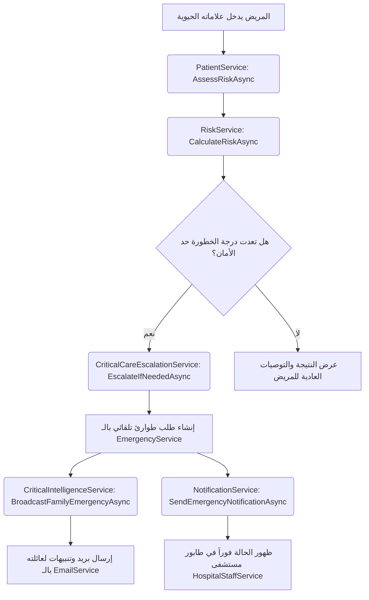
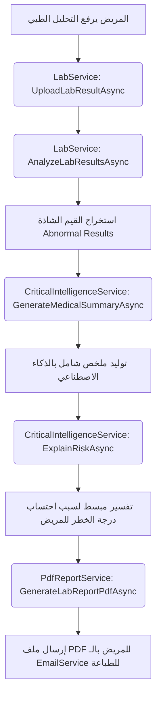

# 🛠️ دليل الخدمات والربط مع المستخدمين لمنصة "اطمئن" (Etmen Services Guide)

يركز هذا الدليل على شرح جميع الخدمات البرمجية (Business Services) المتوفرة في الطبقة البرمجية لمنصة **اطمئن (Etmen)**، مع توضيح الوظيفة الدقيقة لكل خدمة والمستخدمين المستفيدين منها (User Roles) وكيفية تكامل هذه الخدمات لتقديم تجربة رعاية صحية ذكية ومتكاملة.

---

## 👥 نظرة عامة على أدوار المستخدمين (User Roles)
تخدم المنصة مجموعة متنوعة من الأدوار، لكل منها صلاحيات واحتياجات مختلفة:
1. **الزائر (Visitor / Guest):** مستخدم غير مسجل يستكشف المنصة وينشئ حساباً.
2. **المريض (Patient):** المستخدم الأساسي الذي يتابع حالته الصحية، يسجل قياساته الحيوية، يحجز مواعيد، ويرسل طلبات طوارئ.
3. **فرد العائلة (Family Member):** قريب مرتبط بحساب المريض لمتابعة حالته والمساعدة في حجوزاته وتلقي إشعارات الطوارئ عنه.
4. **الطبيب (Doctor):** يقدم الاستشارات الطبية، يحدد مواعيد عمله، يتابع سجلات مرضاه، ويشخص حالتهم.
5. **موظف المستشفى (Hospital Staff):** يستقبل طلبات الطوارئ، يدير الطابور (Queue)، ويحدث سعة الأسرة المتاحة.
6. **المدير (Admin):** يتحكم بإعدادات النظام والمستخدمين والجهات الطبية المزودة للخدمة.
7. **مدير الأزمات (Crisis Admin):** يدير حالات الطوارئ العامة والأوبئة، ويحدد مناطق التفشي وأعراض الأزمة وأوزانها.

---

## 📊 جدول التغطية السريع (Services to Users Mapping)

يلخص الجدول التالي العلاقة بين كل خدمة (Service) والأدوار التي تستفيد منها بشكل مباشر أو غير مباشر:

| اسم الخدمة (Service Name) | الزائر | المريض | العائلة | الطبيب | موظف المستشفى | المدير | مدير الأزمات | نوع التشغيل / الوظيفة الأساسية |
| :--- | :---: | :---: | :---: | :---: | :---: | :---: | :---: | :--- |
| **AuthService** | ✅ | ✅ | - | ✅ | ✅ | ✅ | ✅ | إدارة الجلسات وإنشاء الحسابات والتحقق |
| **PatientService** | - | ✅ | - | - | - | - | - | إدارة لوحة المريض، ملفه الشخصي، وتقييماته |
| **DoctorService** | - | - | - | ✅ | - | - | - | إدارة ملف الطبيب، مواعيده، وجداول التوفر |
| **AppointmentService** | ✅ | ✅ | ✅ | - | - | - | - | حجز وإلغاء المواعيد من جانب المرضى |
| **MedicalRecordService** | - | ✅ | ✅ | ✅ | - | - | - | إدارة وتخزين المؤشرات الحيوية والتاريخ الطبي |
| **LabService** | - | ✅ | - | ✅ | ✅ | - | - | إدارة نتائج التحاليل والتحقق منها وتحليلها |
| **NearbyService** | ✅ | ✅ | ✅ | - | - | - | - | البحث الجغرافي وحجز أقرب مقدم رعاية |
| **EmergencyService** | - | ✅ | - | - | ✅ | - | - | إرسال واستقبال وتتبع بلاغات الطوارئ |
| **HospitalStaffService** | - | - | - | - | ✅ | - | - | إدارة أسرة المستشفى واستجابة الطوارئ |
| **FamilyService** | - | ✅ | ✅ | - | - | - | - | ربط الحسابات العائلية وإدارة صلاحياتها |
| **ChatbotService (AI)** | ✅ | ✅ | - | - | - | - | - | مساعد ذكي للإجابة عن التساؤلات العامة |
| **ChatService** | - | ✅ | - | ✅ | - | - | - | محادثات نصية واستشارات مباشرة مريض-طبيب |
| **AlertService** | - | ✅ | ✅ | ✅ | - | - | - | توليد تنبيهات لحظية بناءً على المؤشرات |
| **NotificationService** | - | ✅ | ✅ | ✅ | ✅ | ✅ | ✅ | إدارة جميع إشعارات النظام البريدية والداخلية |
| **RiskService** | - | ✅ | - | ✅ | - | - | - | احتساب وتخنيف درجات الخطورة الطبية |
| **CrisisService** | - | - | - | - | - | ✅ | ✅ | تهيئة الأزمات وتحديد الأعراض وأوزانها |
| **CrisisRiskEngineService** | - | ✅ | - | - | - | - | ✅ | حساب خطر الأزمة والبحث الجغرافي للتفشي |
| **CriticalCareEscalationService**| - | ✅ | - | ✅ | ✅ | - | - | الفرز والتصعيد التلقائي للحالات الخطيرة |
| **CriticalIntelligenceService** | - | - | ✅ | ✅ | ✅ | ✅ | ✅ | لوحة القيادة الذكية والتنبؤ والتفسير الطبي |
| **PdfReportService** | - | ✅ | ✅ | ✅ | - | - | - | طباعة التقارير المخبرية، المواعيد والمخاطر |
| **EmailService** | ✅ | ✅ | ✅ | ✅ | ✅ | - | - | إرسال المراسلات والتقارير الطبية الهامة |
| **AppointmentReminderService**  | - | ✅ | - | ✅ | - | - | - | خدمة خلفية آلية للتذكير بالمواعيد |

---

## 🔍 الشرح التفصيلي للخدمات (Detailed Services Breakdown)

### 1. خدمات الهوية والوصول (Identity & Access)

#### 🔐 [AuthService](file:///c:/Users/Kozmo0_2/source/repos/Etmen_DEPI_Project-ElSherka/Etmen_BLL/Repositories/Services/AuthService.cs)
* **الوظيفة الطبية/التقنية:** البوابة الأمنية لكافة مستخدمي المنصة. تتعامل مع إدارة الحسابات، التحقق، كلمات المرور، وحماية مسارات التطبيق.
* **الأدوار المستفيدة:** جميع الأدوار والزوار الجدد.
* **العمليات الأساسية:**
  * `RegisterAsync`: تسجيل حساب جديد وتحديد دوره بالنظام.
  * `LoginAsync`: التحقق من الهوية وإصدار صلاحيات الدخول المناسبة (JWT Token).
  * `VerifyEmailAsync`: تفعيل الحسابات عن طريق البريد الإلكتروني.
  * `ForgotPasswordAsync` / `ResetPasswordAsync`: إعادة تعيين كلمات المرور المنسية بشكل آمن.
  * `DeactivateAccountAsync`: تمكين المستخدم من تجميد حسابه.

---

### 2. خدمات رعاية ومتابعة المريض (Patient Care & Monitoring)

#### 👤 [PatientService](file:///c:/Users/Kozmo0_2/source/repos/Etmen_DEPI_Project-ElSherka/Etmen_BLL/Repositories/Services/PatientService.cs)
* **الوظيفة الطبية/التقنية:** المحرك الأساسي للمريض لإدارة ملفه الصحي وتوليد لوحة معلوماته اليومية التي يرى فيها وضعه الصحي بشكل ملخص.
* **الأدوار المستفيدة:** المريض.
* **العمليات الأساسية:**
  * `GetProfileAsync` / `UpdateProfileAsync`: إدارة بيانات المريض الطبية الثابتة (فصيلة الدم، الحساسية، الأمراض المزمنة، الأدوية، الوزن والطول).
  * `GetDashboardAsync`: تجميع أحدث البيانات لعرضها للمريض فور دخوله (آخر تقييم مخاطر، المواعيد القادمة، الإشعارات الصحية، تنبيهات الأزمة).
  * `AssessRiskAsync`: استقبال العلامات الحيوية اللحظية وحساب معامل الخطر.

#### 📈 [MedicalRecordService](file:///c:/Users/Kozmo0_2/source/repos/Etmen_DEPI_Project-ElSherka/Etmen_BLL/Repositories/Services/MedicalRecordService.cs)
* **الوظيفة الطبية/التقنية:** حفظ السجل التاريخي لكافة القياسات الحيوية للمريض (مثل الضغط، السكر، النبض، الحرارة، نسبة الأكسجين).
* **الأدوار المستفيدة:** المريض، الطبيب المعالج، وأفراد العائلة (حسب الصلاحيات).
* **العمليات الأساسية:**
  * `CreateAsync`: حفظ قراءات جديدة للمؤشرات الحيوية.
  * `GetByPatientAsync` / `GetLatestAsync`: استرجاع السجلات التاريخية أو أحدث قياس مسجل.
  * `GetByDateRangeAsync`: تصفية القياسات لفترة محددة لمراقبة مدى استقرار المريض.
  * `GetWithAbnormalValuesAsync`: تصفية واستخراج القراءات التي خرجت عن الحدود الآمنة الطبيعية لمتابعتها بجدية.

#### 🧪 [LabService](file:///c:/Users/Kozmo0_2/source/repos/Etmen_DEPI_Project-ElSherka/Etmen_BLL/Repositories/Services/LabService.cs)
* **الوظيفة الطبية/التقنية:** إدارة التحاليل والأشعة الطبية المرفوعة من المريض، وتحليلها برمجياً لاستخلاص القيم غير الطبيعية واعتمادها طبياً.
* **الأدوار المستفيدة:** المريض، الأطباء، موظفو المختبرات.
* **العمليات الأساسية:**
  * `UploadLabResultAsync`: رفع ملف التحليل الطبي وتسجيل بياناته.
  * `AnalyzeLabResultsAsync`: تحليل رقمي للنتائج لاستخراج ملخص طبي مؤتمت.
  * `GetAbnormalResultsAsync`: تحديد القراءات المخبرية الشاذة وعزلها للمراجعة الفورية.
  * `VerifyLabResultAsync` / `RejectLabResultAsync`: مراجعة واعتماد الفحوصات من قبل الموظفين المخولين لضمان دقة البيانات الطبية.

---

### 3. خدمات الطوارئ والاستجابة السريعة (Emergency & Crisis Management)

#### 🚨 [EmergencyService](file:///c:/Users/Kozmo0_2/source/repos/Etmen_DEPI_Project-ElSherka/Etmen_BLL/Repositories/Services/EmergencyService.cs)
* **الوظيفة الطبية/التقنية:** نظام الاستغاثة وتلقي بلاغات الطوارئ الفورية من المرضى الذين يعانون من تدهور صحي حاد وتوجيهها للمستشفيات المناسبة.
* **الأدوار المستفيدة:** المريض، موظفو الطوارئ بالمستشفى.
* **العمليات الأساسية:**
  * `CreateEmergencyRequestAsync`: إنشاء بلاغ طوارئ جديد يضم الإحداثيات الجغرافية للمريض ووصف حالته وبياناته الطبية الحرجة.
  * `GetPendingEmergenciesAsync`: جلب البلاغات النشطة والمعلقة ليتعامل معها النظام فوراً.
  * `UpdateEmergencyStatusAsync`: تحديث حالة الاستجابة للطوارئ (مقبول، ملغي، قيد المتابعة).

#### 🏥 [HospitalStaffService](file:///c:/Users/Kozmo0_2/source/repos/Etmen_DEPI_Project-ElSherka/Etmen_BLL/Repositories/Services/HospitalStaffService.cs)
* **الوظيفة الطبية/التقنية:** تمنح موظفي الطوارئ بالمستشفى الأدوات اللازمة لاستقبال الحالات وتدبير الطاقة الاستيعابية.
* **الأدوار المستفيدة:** موظف المستشفى (Hospital Staff).
* **العمليات الأساسية:**
  * `GetQueueAsync`: جلب قائمة حالات الطوارئ الموجهة للمستشفى الخاص بالموظف مرتبة بالأولوية.
  * `GetRequestDetailAsync`: عرض تفاصيل المريض الطبية الطارئة (الحساسية، زمرة الدم، الأمراض المزمنة) لمساعدة الطاقم الطبي قبل وصول الحالة.
  * `RespondToRequestAsync`: اتخاذ قرار الاستجابة السريعة (قبول الحالة لحجز سرير، أو رفضها مع بيان السبب، أو تصعيدها لمزود آخر).
  * `UpdateBedsAsync`: تحديث السعة اللحظية لأسرة الطوارئ المتاحة بالمستشفى (والتي تؤثر على توجيه طلبات الطوارئ للمستشفى).

#### 🧬 [CrisisService](file:///c:/Users/Kozmo0_2/source/repos/Etmen_DEPI_Project-ElSherka/Etmen_BLL/Repositories/Services/CrisisService.cs)
* **الوظيفة الطبية/التقنية:** تهيئة النظام للتعامل مع الأوبئة والكوارث العامة (مثل كوفيد-19، حمى الضنك) وتحديد أعراضها وقواعد الخطر المرتبطة بها.
* **الأدوار المستفيدة:** مدير الأزمات (Crisis Admin)، والمدير العام.
* **العمليات الأساسية:**
  * `CreateCrisisAsync` / `ActivateCrisisAsync`: إنشاء أزمة صحية جديدة وتفعيل "وضع الأزمة" (Crisis Mode) على المنصة بالكامل.
  * `AddSymptomAsync` / `UpdateSymptomAsync`: تحديد الأعراض المرتبطة بهذه الأزمة وإسناد أوزان رقمية لها تدل على خطورتها.
  * `UpdateRiskThresholdsAsync`: ضبط الحدود الحسابية لنظام التقييم (متى تعتبر الحالة طوارئ أو خطرة أثناء الأزمة).

#### 🗺️ [CrisisRiskEngineService](file:///c:/Users/Kozmo0_2/source/repos/Etmen_DEPI_Project-ElSherka/Etmen_BLL/Repositories/Services/CrisisRiskEngineService.cs)
* **الوظيفة الطبية/التقنية:** المحرك الحسابي الجغرافي الذي يقيم مدى خطورة حالة المريض المعرض للأزمة العامة.
* **الأدوار المستفيدة:** المريض، مدير الأزمات.
* **العمليات الأساسية:**
  * `CalculateCrisisRiskAsync`: حساب درجة خطورة مركبة تجمع بين الأعراض العامة للمريض، الأعراض الخاصة بالوباء، وموقعه الجغرافي.
  * `CalculateOutbreakProbabilityAsync`: حساب احتمالية تفشي الوباء في إحداثيات معينة بناءً على كثافة البلاغات.
  * `GetPatientsInZoneAsync`: حصر المرضى المتواجدين داخل نطاق تفشي وبائي (Outbreak Zone) لإرسال تنبيهات وقائية لهم.

---

### 4. خدمات الذكاء الاصطناعي والاستخبارات الطبية (AI & Intelligence Services)

#### 🧠 [CriticalIntelligenceService](file:///c:/Users/Kozmo0_2/source/repos/Etmen_DEPI_Project-ElSherka/Etmen_BLL/Repositories/Services/CriticalIntelligenceService.cs)
* **الوظيفة الطبية/التقنية:** العقل المفكر للمنصة. يربط بين الذكاء الاصطناعي والبيانات الصحية للتنبؤ بالتدهور الصحي ومساعدة متخذي القرار.
* **الأدوار المستفيدة:** الأطباء، القيادة والتحكم، المريض، أفراد العائلة.
* **العمليات الأساسية:**
  * `GetCommandCenterAsync`: توفير شاشة مركز القيادة والتحكم للمديرين لمراقبة معدلات الإصابة بالأزمات والطلبات الفورية.
  * `GetDoctorPanicInboxAsync`: بريد الذعر الخاص بالأطباء لاستقبال تنبيهات المرضى الذين في حالة انهيار صحي فوري.
  * `AssignBestDoctorAsync`: اختيار وتكليف أفضل طبيب مناسب جغرافياً وتخصصياً للتعامل مع المريض المستغيث.
  * `PredictDeteriorationAsync`: خوارزمية تنبؤية تحلل القياسات الحيوية الأخيرة للمريض لتتوقع احتمالية تدهور حالته خلال الـ 24 ساعة القادمة.
  * `BroadcastFamilyEmergencyAsync`: بث إنذار فوري ومؤتمت بالبريد والرسائل لكافة أفراد العائلة المسجلين عند حدوث طوارئ للمريض.
  * `GetCrisisHeatmapAsync`: توليد خريطة حرارية تفاعلية توضح بؤر انتشار الأزمات.
  * `GenerateMedicalSummaryAsync`: كتابة ملخص طبي شامل بالذكاء الاصطناعي عن تاريخ المريض الطبي ليقرأه الطبيب في ثوانٍ.
  * `ExplainRiskAsync` / `ExplainRiskAssessmentAsync`: محرك تفسير الذكاء الاصطناعي (Explainable AI) لتوضيح أسباب احتساب درجة الخطورة بلغة مبسطة للمريض.

#### 🤖 [ChatbotService / AIChatService](file:///c:/Users/Kozmo0_2/source/repos/Etmen_DEPI_Project-ElSherka/Etmen_BLL/Repositories/Services/AIChatService.cs)
* **الوظيفة الطبية/التقنية:** المساعد الذكي "اطمئن" المتاح على مدار الساعة للإجابة عن الاستفسارات الطبية العامة والتغذوية بالاعتماد على Gemini API.
* **الأدوار المستفيدة:** المريض، والزائر.
* **العمليات الأساسية:**
  * `AskAsync`: استقبال الأسئلة الصحية والرد عليها بنصائح عملية وداعمة، مع حظر الإجابة على الأسئلة غير الطبية أو تشخيص الأمراض أو صرف الأدوية حرصاً على سلامة المرضى.

---

### 5. خدمات العيادات وحجز المواعيد (Clinics & Appointments)

#### 👨‍⚕️ [DoctorService](file:///c:/Users/Kozmo0_2/source/repos/Etmen_DEPI_Project-ElSherka/Etmen_BLL/Repositories/Services/DoctorService.cs)
* **الوظيفة الطبية/التقنية:** الخدمة الرئيسية للطبيب لتنظيم عمله اليومي وكتابة تقاريره الطبية.
* **الأدوار المستفيدة:** الأطباء.
* **العمليات الأساسية:**
  * `GetDashboardAsync` / `GetStatisticsAsync`: إحصائيات يومية لعدد الحالات المجدولة، المواعيد المكتملة، وحجم الاستشارات.
  * `AddSlotAsync` / `BulkAddSlotsAsync`: إدراج فترات العمل المتاحة للحجز (الخانات الزمنية) بشكل فردي أو جماعي لفترة زمنية محددة.
  * `UpdateAppointmentStatusAsync`: التحكم في حالة الموعد (تأكيد، إكمال، إلغاء، تسجيل غياب المريض).
  * `AddMedicalRecordForPatientAsync`: تمكين الطبيب من كتابة التشخيص، العلاج، ووصف الأدوية مباشرة في السجل الطبي للمريض.

#### 📅 [AppointmentService](file:///c:/Users/Kozmo0_2/source/repos/Etmen_DEPI_Project-ElSherka/Etmen_BLL/Repositories/Services/AppointmentService.cs)
* **الوظيفة الطبية/التقنية:** إدارة عملية الحجز من جانب المريض وتتبع حالة المواعيد.
* **الأدوار المستفيدة:** المريض، أفراد عائلته.
* **العمليات الأساسية:**
  * `BookAppointmentAsync`: حجز موعد محدد لدى طبيب بعد اختيار خانة زمنية شاغرة.
  * `CancelAppointmentAsync`: إلغاء موعد مجدول مع إخطار الطبيب فورياً.
  * `GetUpcomingAppointmentsAsync` / `GetPatientAppointmentsAsync`: عرض المواعيد النشطة للمريض لترتيب زياراته.

#### 🗺️ [NearbyService](file:///c:/Users/Kozmo0_2/source/repos/Etmen_DEPI_Project-ElSherka/Etmen_BLL/Repositories/Services/NearbyService.cs)
* **الوظيفة الطبية/التقنية:** محرك البحث الجغرافي لتحديد أقرب الأطباء والعيادات والمستشفيات.
* **الأدوار المستفيدة:** المريض، الزائر.
* **العمليات الأساسية:**
  * `SearchNearbyProvidersAsync`: البحث عن مزودي الخدمة وتصفيتهم بناءً على المسافة بالكيلومتر، التخصص الطبي، ووجود قسم طوارئ.
  * `GetAvailableSlotsByProviderAsync`: جلب جدول المواعيد المتاح للمزود المختار لحجز موعد فوري.

---

### 6. خدمات الدعم اللوجستي والاتصال (Support & Communications)

#### 👨‍👩‍👧‍👦 [FamilyService](file:///c:/Users/Kozmo0_2/source/repos/Etmen_DEPI_Project-ElSherka/Etmen_BLL/Repositories/Services/FamilyService.cs)
* **الوظيفة الطبية/التقنية:** إدارة علاقات الربط العائلي والتحكم بصلاحيات تبادل البيانات الطبية لمساعدة كبار السن والأطفال.
* **الأدوار المستفيدة:** المريض، أفراد عائلته.
* **العمليات الأساسية:**
  * `InviteFamilyMemberAsync`: إرسال دعوة ربط بالبريد الإلكتروني لأحد أفراد العائلة.
  * `AcceptFamilyInviteAsync`: إدخال رمز التحقق وقبول الارتباط العائلي.
  * `UpdateFamilyPermissionsAsync`: تحديد الصلاحيات الممنوحة للقريب (مثلاً: السماح له برؤية السجل الطبي فقط، أو قراءة التقييمات، أو القدرة على حجز مواعيد نيابة عنه).

#### 🔕 [AlertService](file:///c:/Users/Kozmo0_2/source/repos/Etmen_DEPI_Project-ElSherka/Etmen_BLL/Repositories/Services/AlertService.cs)
* **الوظيفة الطبية/التقنية:** الخدمة المختصة بالتنبيهات العاجلة المرتبطة مباشرة بالحالة الصحية للمريض (كارتفاع الضغط المفاجئ، أو دخول منطقة تفشي وبائي).
* **الأدوار المستفيدة:** المريض، الطبيب، العائلة.
* **العمليات الأساسية:**
  * `CreateAlertAsync`: توليد تنبيه طبي فوري بناءً على تدهور مؤشر حيوي.
  * `GetUnreadAlertsAsync`: جلب التنبيهات الصحية الهامة التي لم يقرأها المريض بعد لتظهر بشكل مميز في لوحته.

#### 🔔 [NotificationService](file:///c:/Users/Kozmo0_2/source/repos/Etmen_DEPI_Project-ElSherka/Etmen_BLL/Repositories/Services/NotificationService.cs)
* **الوظيفة الطبية/التقنية:** مركز إدارة الإشعارات العام في التطبيق (رسائل نصية، إشعارات ويب، بريد إلكتروني). مسؤول عن إيصال الرسائل الإدارية والتشغيلية.
* **الأدوار المستفيدة:** جميع الأدوار والنظام.
* **العمليات الأساسية:**
  * `SendAppointmentReminderAsync`: إرسال تذكير للمريض والطبيب باقتراب موعد الاستشارة.
  * `SendCrisisAlertAsync`: إرسال تحذيرات عامة للمرضى المستهدفين بوجود أزمة نشطة أو إرشادات وقائية جديدة.
  * `SendEmergencyNotificationAsync`: إخطار موظفي الطوارئ فور تلقي بلاغ استغاثة جديد.

#### ✉️ [EmailService](file:///c:/Users/Kozmo0_2/source/repos/Etmen_DEPI_Project-ElSherka/Etmen_BLL/Repositories/Services/EmailService.cs)
* **الوظيفة الطبية/التقنية:** خدمة المراسلات البريدية المؤمنة والتفاعلية، تعتمد على قوالب HTML مجهزة مسبقاً لمخاطبة المستخدم باسمه ودوره وتضمين المرفقات الطبية.
* **الأدوار المستفيدة:** جميع الأدوار.
* **العمليات الأساسية:**
  * `SendEmailWithPdfAttachmentAsync`: إرسال الفحوصات والتقارير الطبية للمريض كملفات PDF عبر بريده الشخصي للطباعة.
  * `SendWelcomeEmailAsync` / `SendPasswordResetEmailAsync`: إرسال الرسائل الإدارية الأساسية لرحلة المستخدم.
  * `SendRiskAlertEmailAsync`: إرسال إشعار فوري لعائلة المريض عند دخوله مرحلة الخطر الشديد موضحاً به التوصيات الطبية العاجلة.

#### 📄 [PdfReportService](file:///c:/Users/Kozmo0_2/source/repos/Etmen_DEPI_Project-ElSherka/Etmen_BLL/Repositories/Services/PdfReportService.cs)
* **الوظيفة الطبية/التقنية:** تحويل البيانات الرقمية المعقدة (نتائج تحاليل، درجات مخاطر، مواعيد مجدولة) إلى وثائق رسمية منسقة بصيغة PDF.
* **الأدوار المستفيدة:** المريض، الطبيب، وأفراد العائلة.
* **العمليات الأساسية:**
  * `GenerateLabReportPdfAsync`: إنشاء تقرير PDF للتحاليل مدعوماً ببيانات الـ OCR للمستندات الطبية.
  * `GenerateRiskReportPdfAsync`: توليد تقرير متكامل لتقييم المخاطر يضم الأعراض المحفزة والتوصيات الطبية المباشرة لتسهيل مشاركته مع الأطباء خارج المنصة.
  * `GenerateAppointmentPdfAsync`: توليد إيصال تأكيد الحجز للموعد يضم تفاصيل العيادة والوقت وإرشادات ما قبل الزيارة.

---

### 7. خدمات الأنظمة الخلفية والذكاء الحسابي (Computational & Background Services)

#### 🧮 [RiskService](file:///c:/Users/Kozmo0_2/source/repos/Etmen_DEPI_Project-ElSherka/Etmen_BLL/Repositories/Services/RiskService.cs)
* **الوظيفة الطبية/التقنية:** المحرك الرياضي والحسابي المسؤول عن تحويل المدخلات الحيوية للمريض (كالضغط والنبض والسكر) إلى درجة خطورة صحية رقمية.
* **الأدوار المستفيدة:** المريض، الأطباء، والنظام.
* **العمليات الأساسية:**
  * `CalculateRiskAsync`: تطبيق القواعد الطبية لحساب درجة الخطورة الإجمالية وتحديد مستوى الحالة (طبيعي، متوسط، خطر، طوارئ).
  * `SaveRiskAssessmentAsync`: أرشفة النتائج في قاعدة البيانات لتمكين خدمات التنبؤ من قراءة التاريخ الصحي لاحقاً.

#### 🩺 [CriticalCareEscalationService](file:///c:/Users/Kozmo0_2/source/repos/Etmen_DEPI_Project-ElSherka/Etmen_BLL/Repositories/Services/CriticalCareEscalationService.cs)
* **الوظيفة الطبية/التقنية:** الفرز التلقائي الفوري للحالات الحرجة التي تتدهور علاماتها الحيوية فجأة.
* **الأدوار المستفيدة:** المريض، الطبيب، وموظفو الطوارئ.
* **العمليات الأساسية:**
  * `EscalateIfNeededAsync`: مراقبة قراءات تقييم المخاطر بشكل فوري، وتحديد ما إذا كان المريض يحتاج إلى تصعيد سريري فوري (Clinical Escalation) وتوجيهه تلقائياً لقسم الطوارئ إذا لزم الأمر.
  * `GetCriticalCasesAsync`: تزويد لوحات التحكم بقائمة الحالات الحرجة النشطة التي تتطلب تدخلاً بشرياً عاجلاً.

#### ⏰ [AppointmentReminderHostedService](file:///c:/Users/Kozmo0_2/source/repos/Etmen_DEPI_Project-ElSherka/Etmen_BLL/Repositories/Services/AppointmentReminderHostedService.cs)
* **الوظيفة الطبية/التقنية:** خدمة خلفية مجدولة (Hosted Background Worker) تعمل بشكل دائم في خادوم التطبيق دون تدخل بشري، تفحص مواعيد العيادات وتطلق التذكيرات.
* **الأدوار المستفيدة:** المريض، الطبيب.
* **العمليات الأساسية:**
  * تقوم الخدمة الخلفية بعمل دورة فحص مستمرة في قاعدة البيانات لتحديد المواعيد المجدولة التي يحين وقت التنبيه لها (مثال: قبل 24 ساعة لتهيئة المريض، وقبل ساعتين للتأكيد الفوري)، ثم تقوم باستدعاء `NotificationService` لإرسال الإشعار.

---

## 🔄 كيف تتكامل هذه الخدمات؟ (سياق رحلة المستخدم)

لتقديم رعاية صحية ذكية، لا تعمل الخدمات بشكل منفصل بل تتكامل كالتالي:

### أ. رحلة تقييم المخاطر وتصعيد الطوارئ (Emergency Escalation Flow)

### ب. رحلة الكشف والتحاليل المخبرية والتفسير (Lab & AI Analysis Flow)

